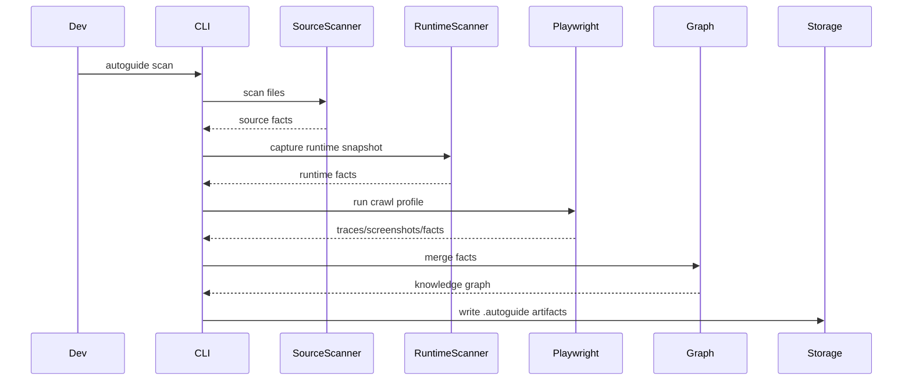
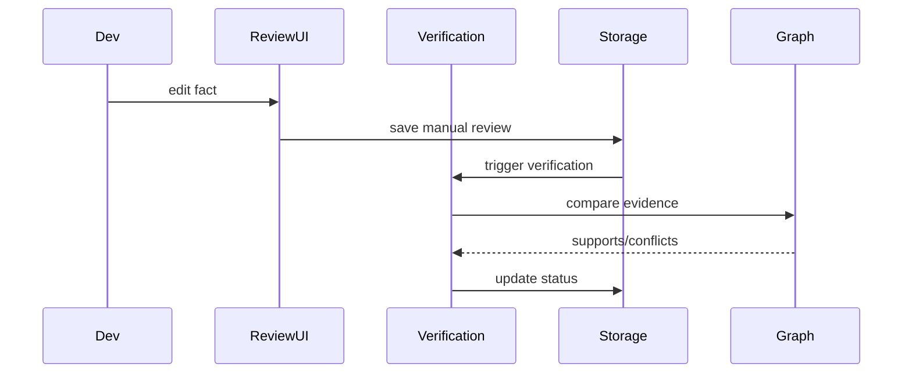

---

<!-- FILE: 00-overview/glossary.md -->

# AutoGuide Specification

**Version:** v0.1  
**Type:** AI Engineering Specification + PRD + TRD  
**Audience:** Cursor / Claude Code / Codex / human engineering team  
**Principles:** local-first, open-source-first, deterministic-before-AI, plugin-based, reviewable, version-aware.


# Glossary

## AutoGuide

The full product: SDK, scanner, CLI, runtime UI, docs engine and optional plugins.

## Documentation Intelligence Engine

The system that converts code, runtime behavior, traces and reviewed knowledge into documentation artifacts.

## Feature

A user-visible capability of the application. Example: `Approve vacation request`.

## Page

A routable or stateful UI surface. Example: `/hr/vacation/requests`.

## Flow

A sequence of steps that produces an outcome. Example: `Create employee`.

## Fact

A single knowledge claim. Example: `The Approve button approves a vacation request.`

## Provenance

Where a fact came from. Examples: source code, runtime DOM, accessibility tree, Playwright trace, AI enrichment, developer review, config or plugin.

## Confidence

A numeric score between 0 and 1 describing how likely a fact is correct.

## Verification

The process of checking a fact against evidence.

## Manual Override

Developer-reviewed knowledge that overrides AI or automatic inference.

## Recommendation

A concrete code or configuration improvement suggested by AutoGuide to make the app easier to understand.


---

<!-- FILE: 00-overview/goals.md -->

# AutoGuide Specification

**Version:** v0.1  
**Type:** AI Engineering Specification + PRD + TRD  
**Audience:** Cursor / Claude Code / Codex / human engineering team  
**Principles:** local-first, open-source-first, deterministic-before-AI, plugin-based, reviewable, version-aware.


# Product Goals

## MVP goals

- Install AutoGuide in a React app.
- Detect routes, pages and visible UI elements.
- Detect interactive elements from DOM and accessibility information.
- Run a Playwright scan against a local app.
- Generate a local `.autoguide/` folder.
- Create `features.json`, `pages.json`, `flows.json` and `confidence.json`.
- Display an in-app Help Widget.
- Display Inspector Mode.
- Allow developer review of uncertain items.
- Export Markdown documentation.
- Persist reviewed facts so AI cannot overwrite them.

## v1 goals

- AI enrichment through OpenAI-compatible APIs and Ollama-compatible local endpoints.
- Guided tour generation.
- Search index with deterministic search first.
- Role-based documentation.
- Version-aware change history.
- PDF and HTML export.
- Plugin API for frameworks and data sources.
- CI command for documentation validation.

## Future goals

- Flutter adapter.
- Tauri adapter.
- Team review mode.
- Optional hosted sync.
- Analytics dashboard.
- Enterprise plugin registry.
- SSO support.
- Advanced visual diff.
- Automated release notes.
- Support-agent mode based only on verified documentation.


---

<!-- FILE: 00-overview/mission.md -->

# AutoGuide Specification

**Version:** v0.1  
**Type:** AI Engineering Specification + PRD + TRD  
**Audience:** Cursor / Claude Code / Codex / human engineering team  
**Principles:** local-first, open-source-first, deterministic-before-AI, plugin-based, reviewable, version-aware.


# Mission

AutoGuide's mission is to make process-heavy software self-explaining.

## Primary mission

Create a reusable open-source SDK and scanner system that lets developers embed documentation intelligence into any supported app.

## Secondary mission

Create a standard for verifiable application documentation where each piece of knowledge has source, confidence, review status, version, owner, affected roles, affected UI surfaces and affected workflows.

## Mission constraints

AutoGuide must work locally without cloud dependency, support commercial expansion later, stay framework-independent at the core, start with React, allow Vue/Angular/Svelte/Tauri/Flutter adapters later, expose uncertainty instead of hiding it, be useful without AI and better with AI, and support AI providers through a provider abstraction.


---

<!-- FILE: 00-overview/non-goals.md -->

# AutoGuide Specification

**Version:** v0.1  
**Type:** AI Engineering Specification + PRD + TRD  
**Audience:** Cursor / Claude Code / Codex / human engineering team  
**Principles:** local-first, open-source-first, deterministic-before-AI, plugin-based, reviewable, version-aware.


# Non-Goals

AutoGuide must not become everything.

## MVP non-goals

- No hosted SaaS dependency.
- No mandatory cloud dashboard.
- No full mobile support in MVP.
- No Cypress support in MVP.
- No enterprise RBAC in MVP.
- No analytics-heavy product adoption suite in MVP.
- No session replay in MVP.
- No replacement for Playwright as a test framework.
- No replacement for product management tools.
- No replacement for full API documentation generators.

## Product non-goals

AutoGuide is not a pure wiki, no-code onboarding platform, generic chatbot, screenshot recorder, test-only tool, full analytics suite or monitoring product.

## Technical non-goals

The core must not depend on React, Vue, Angular, Svelte or Flutter. Framework-specific logic belongs in adapters. AI provider logic must not leak into the core. Storage backends must be replaceable.


---

<!-- FILE: 00-overview/vision.md -->

# AutoGuide Specification

**Version:** v0.1  
**Type:** AI Engineering Specification + PRD + TRD  
**Audience:** Cursor / Claude Code / Codex / human engineering team  
**Principles:** local-first, open-source-first, deterministic-before-AI, plugin-based, reviewable, version-aware.


# Vision

AutoGuide exists because documentation for process-heavy software breaks the moment the software changes.

Business applications contain flows like onboarding, vacation approval, route planning, material management, payroll preparation, customer portals and admin dashboards. These flows are difficult to explain because knowledge is split across UI labels, backend rules, database schemas, roles, permissions, API handlers, onboarding docs and support conversations.

AutoGuide turns the application itself into the primary source for its own documentation.

## Product vision statement

AutoGuide is a Documentation Intelligence Engine that understands an application through source code analysis, runtime inspection, Playwright traces and verified developer feedback, then generates contextual in-app help, guided tours, role-specific documentation, support answers and exports that stay synchronized with the codebase.

## Design philosophy

AutoGuide must not be only a tooltip tool. It must not be a simple Appcues clone. It must not be a generic AI chatbot duct-taped to a wiki. It must build a verified knowledge graph of the application.

## Core beliefs

1. Documentation must be generated from evidence.
2. Source code is evidence.
3. Runtime behavior is evidence.
4. Playwright traces are evidence.
5. Developer confirmation is authoritative evidence.
6. AI output is not evidence by itself.
7. Every generated statement needs provenance.
8. A system that cannot explain uncertainty should not generate trusted docs.

## Long-term ambition

A developer should install AutoGuide in a new application and receive discovered pages, features, forms, roles, APIs, candidate flows, suggested documentation, review tasks, code recommendations, exported docs and in-app help without writing all documentation manually from zero.


---

<!-- FILE: 01-product/acceptance-criteria.md -->

# AutoGuide Specification

**Version:** v0.1  
**Type:** AI Engineering Specification + PRD + TRD  
**Audience:** Cursor / Claude Code / Codex / human engineering team  
**Principles:** local-first, open-source-first, deterministic-before-AI, plugin-based, reviewable, version-aware.


# Acceptance Criteria

## Product-level acceptance

AutoGuide MVP is accepted when:

- A React app can install AutoGuide.
- A local scan produces structured knowledge files.
- A Help Widget can display page-level and feature-level documentation.
- Inspector mode can explain selected elements.
- Confidence state is visible.
- Developer review can change uncertain descriptions.
- AI proposals are clearly marked.
- Reviewed knowledge cannot be overwritten by AI.
- Markdown export works.
- Core functions work without cloud dependency.

## Engineering acceptance

- TypeScript strict mode enabled.
- Core package has no React dependency.
- Public APIs are documented.
- Public APIs have tests.
- All generated JSON validates against schema.
- CLI commands return non-zero exit codes on failure.
- File writes are atomic where needed.
- No API key is required for non-AI scan.

## Documentation acceptance

Generated documentation must include page title, page purpose, role visibility, main actions, known flows, confidence/provenance metadata and last verified timestamp.

## Security acceptance

- No secrets are written to docs.
- Environment variables are redacted.
- Cookies/session data are not persisted unless explicitly enabled.
- Screenshot capture can be disabled.
- PII redaction hooks exist.


---

<!-- FILE: 01-product/customer-journey.md -->

# AutoGuide Specification

**Version:** v0.1  
**Type:** AI Engineering Specification + PRD + TRD  
**Audience:** Cursor / Claude Code / Codex / human engineering team  
**Principles:** local-first, open-source-first, deterministic-before-AI, plugin-based, reviewable, version-aware.


# Customer Journey

## Stage 1: Awareness

Developer realizes documentation debt exists because a new internal app needs onboarding, support asks repeated questions, feature velocity is high, or an AI-built app is hard to explain.

## Stage 2: Installation

Developer runs:

```bash
npm install @autoguide/react
npx autoguide init
```

AutoGuide detects framework, package manager, routes and potential config.

## Stage 3: First scan

Developer runs:

```bash
npx autoguide scan
```

AutoGuide creates `.autoguide/` with pages, elements, candidate features, candidate flows, confidence values and recommendations.

## Stage 4: Review

Developer opens review UI or CLI review. They confirm, edit or reject AI proposals.

## Stage 5: Publish

Developer adds AutoGuide widget to app. End users see Help, Search, Inspector and Guides.

## Stage 6: Continuous update

On code changes, AutoGuide checks Git diff, AST diff, runtime diff and Playwright traces. Changed docs get marked as stale or regenerated.

## Stage 7: Expansion

Team adds plugins, backend schema analysis, exports, AI assistant, analytics and optional hosted sync.


---

<!-- FILE: 01-product/personas.md -->

# AutoGuide Specification

**Version:** v0.1  
**Type:** AI Engineering Specification + PRD + TRD  
**Audience:** Cursor / Claude Code / Codex / human engineering team  
**Principles:** local-first, open-source-first, deterministic-before-AI, plugin-based, reviewable, version-aware.


# Personas

## AI-assisted fullstack developer

Builds fast with Cursor, Claude Code or Codex. Creates new process-heavy apps but documentation lags behind.

Needs:

- Install and scan quickly.
- Receive actionable issues.
- Get generated docs.
- Avoid maintaining docs manually.
- Know which AI outputs are uncertain.

Pain:

- AI-generated features are difficult to explain later.
- App behavior changes faster than docs.
- Naming and component structure become inconsistent.

## Internal operations owner

Owns the business process. May not code, but understands what the software should do.

Needs:

- Review generated explanations.
- Correct wrong descriptions.
- See guides for employees.
- Ensure onboarding material is up to date.

Pain:

- Developers implement features but do not write proper user documentation.
- Employees ask repetitive questions.
- Process changes are not communicated clearly.

## End user

Uses the app to complete work.

Needs:

- Understand current page.
- Know what a button does.
- Receive step-by-step guidance.
- Search for help.
- Ask where to perform a task.

Pain:

- UI is process-heavy.
- Roles and permissions hide options.
- They are afraid to click destructive buttons.

## Support/admin user

Answers questions and trains users.

Needs:

- Reliable documentation.
- Role-specific guides.
- Exportable PDFs or Markdown.
- AI answers grounded in verified docs.


---

<!-- FILE: 01-product/product-requirements.md -->

# AutoGuide Specification

**Version:** v0.1  
**Type:** AI Engineering Specification + PRD + TRD  
**Audience:** Cursor / Claude Code / Codex / human engineering team  
**Principles:** local-first, open-source-first, deterministic-before-AI, plugin-based, reviewable, version-aware.


# Product Requirements Document

## Context

Modern business applications are increasingly built by small teams using fast tools, AI coding assistants, low-code builders, frontend frameworks and backend-as-a-service platforms. Development speed has increased, but documentation quality has not kept up.

When a process-heavy app changes, documentation often becomes wrong. This creates support debt, onboarding friction and operational risk.

AutoGuide solves this by binding documentation generation to the application itself.

## Problem statement

Developers and teams need a way to generate and maintain user-facing and admin-facing documentation directly from the app, without manually writing every guide and without trusting unverified AI output.

## Target users

Primary users:

- Fullstack developers
- AI-assisted developers
- Solo builders
- Internal tool builders
- Technical product owners

Secondary users:

- Support teams
- Admins
- HR teams
- Operations managers
- End users of process-heavy software

## Primary use cases

1. Generate user documentation for an internal HR app.
2. Generate process documentation for a field operations app.
3. Provide contextual help inside an ERP module.
4. Explain buttons, pages and flows without manually writing all tooltips.
5. Detect when documentation is stale after code changes.
6. Ask documentation-based questions inside the app.
7. Export Markdown or PDF for onboarding.

## Required capabilities

Functional requirements:

- Installable SDK
- Runtime scanning
- Source scanning
- Playwright scanning
- Local project storage
- Feature registry
- Confidence engine
- Verification workflow
- Recommendation engine
- Help widget
- Inspector mode
- Guided tour model
- Search model
- Export model

Non-functional requirements:

- Local-first
- Framework-agnostic core
- TypeScript-first
- Plugin-based
- Testable
- Deterministic when possible
- AI-provider independent
- Secure by default
- No sensitive data leakage by default

## Product boundary

AutoGuide creates documentation and guidance. It does not own business logic. It does not modify the host application without developer action. It can recommend changes, but the developer applies them.


---

<!-- FILE: 01-product/roadmap.md -->

# AutoGuide Specification

**Version:** v0.1  
**Type:** AI Engineering Specification + PRD + TRD  
**Audience:** Cursor / Claude Code / Codex / human engineering team  
**Principles:** local-first, open-source-first, deterministic-before-AI, plugin-based, reviewable, version-aware.


# Roadmap

## Phase 0: Specification

Deliver Markdown spec repository, architecture decisions, issue templates and coding-agent contract.

## Phase 1: Core MVP

Monorepo, core types, config loader, local storage writer, JSON schema validation, React adapter skeleton and Help Widget placeholder.

## Phase 2: Runtime discovery

DOM scanner, route detector, accessibility collector, element graph, runtime serializer and Inspector mode.

## Phase 3: Source scanner

AST scanner, route scanner, component scanner, handler detector and backend adapter interface.

## Phase 4: Confidence and review

Confidence scoring, provenance model, review state, verification rerun and manual override persistence.

## Phase 5: Playwright

Playwright integration, crawl profile, screenshots, traces and flow candidates.

## Phase 6: AI enrichment

Provider interface, OpenAI-compatible provider, Ollama-compatible provider, prompt templates and AI output validation.

## Phase 7: Documentation

Documentation generator, Markdown export, Help Widget content rendering, search index and guided tour model.

## Phase 8: Plugins and expansion

Plugin API, Vue/Svelte prototypes, Supabase plugin, OpenAPI plugin, PDF/HTML export.


---

<!-- FILE: 01-product/user-flows.md -->

# AutoGuide Specification

**Version:** v0.1  
**Type:** AI Engineering Specification + PRD + TRD  
**Audience:** Cursor / Claude Code / Codex / human engineering team  
**Principles:** local-first, open-source-first, deterministic-before-AI, plugin-based, reviewable, version-aware.


# User Flows

## Developer initializes AutoGuide

1. Run `npx autoguide init`.
2. CLI detects framework.
3. CLI creates `autoguide.config.ts`.
4. CLI checks whether Playwright is installed.
5. CLI offers to create scan profile.
6. CLI creates `.autoguide/`.

Acceptance:

- Works in a React Vite app.
- Does not break build.
- Does not require cloud login.

## Developer runs scan

1. Run `npx autoguide scan`.
2. Source scanner reads project.
3. Runtime scanner opens app.
4. Playwright scanner crawls routes.
5. Knowledge graph is generated.
6. Confidence report is written.

Acceptance:

- Produces JSON artifacts.
- Produces readable scan summary.
- Fails safely when app cannot start.

## Developer reviews uncertain facts

1. Run `npx autoguide review`.
2. Review UI lists uncertain facts.
3. Developer accepts, edits or rejects.
4. AutoGuide stores review as manual evidence.
5. Verification engine reruns checks.

Acceptance:

- Reviewed facts cannot be overwritten by AI.
- Review history is preserved.

## End user asks for help

1. User opens Help Widget.
2. Current page context is detected.
3. Widget shows page explanation.
4. User searches for task.
5. User starts a guide.

Acceptance:

- Search does not expose hidden role-restricted content.
- Guide can be closed at any time.
- Help is available offline if docs are bundled.

## Inspector mode

1. User activates Inspector.
2. UI elements are highlighted on hover.
3. User clicks an element.
4. AutoGuide shows known facts, confidence and actions.
5. Developer/admin can edit facts.

Acceptance:

- Inspector does not trigger app actions while active.
- Highlights are accessible and keyboard compatible.


---

<!-- FILE: 02-architecture/ai-engine.md -->

# AutoGuide Specification

**Version:** v0.1  
**Type:** AI Engineering Specification + PRD + TRD  
**Audience:** Cursor / Claude Code / Codex / human engineering team  
**Principles:** local-first, open-source-first, deterministic-before-AI, plugin-based, reviewable, version-aware.


# AI Engine

## Purpose

The AI Engine enriches incomplete information. It does not create trusted truth by itself.

## Provider architecture

```ts
interface AIProvider {
  name: string;
  complete(request: AICompletionRequest): Promise<AICompletionResponse>;
}
```

Supported providers: OpenAI-compatible endpoint, Ollama-compatible endpoint, Anthropic-compatible later, Gemini-compatible later and custom endpoint.

## AI use cases

- propose descriptions
- summarize pages
- propose guide steps
- detect possible workflows
- rewrite docs in simpler language
- generate translations
- generate FAQ
- generate support answers from verified docs

## AI constraints

- AI output must validate against schema.
- AI output must be marked `ai_proposal`.
- AI output must never overwrite verified/manual facts.
- AI prompt must include evidence and ask for uncertainty classification.

## Prompt rule

The model must be instructed to use only provided evidence, say unknown if unknown, mark assumptions, not invent routes/APIs/permissions and return JSON only for structured tasks.


---

<!-- FILE: 02-architecture/confidence-engine.md -->

# AutoGuide Specification

**Version:** v0.1  
**Type:** AI Engineering Specification + PRD + TRD  
**Audience:** Cursor / Claude Code / Codex / human engineering team  
**Principles:** local-first, open-source-first, deterministic-before-AI, plugin-based, reviewable, version-aware.


# Confidence Engine

## Purpose

The Confidence Engine scores facts based on evidence quality.

## Evidence hierarchy

Highest trust:

1. Developer-reviewed fact
2. Explicit config
3. Explicit `data-autoguide-*`
4. Explicit `data-doc-*`
5. Source code function/handler analysis
6. Backend/API/schema match
7. Runtime DOM/accessibility evidence
8. Playwright trace behavior
9. AI proposal

## Confidence ranges

- 1.00: developer verified
- 0.95 - 0.99: explicit metadata
- 0.85 - 0.94: strong source + runtime agreement
- 0.70 - 0.84: multiple weak signals
- 0.50 - 0.69: plausible but uncertain
- below 0.50: weak / should not be shown as fact

## Review thresholds

- below 0.75: needs review
- AI-generated descriptions: needs review unless explicitly accepted
- conflicts: always needs review
- destructive action descriptions: always needs review

## Destructive actions

Examples: delete, archive, revoke, remove, terminate, deactivate, approve payment, submit payroll.


---

<!-- FILE: 02-architecture/knowledge-graph.md -->

# AutoGuide Specification

**Version:** v0.1  
**Type:** AI Engineering Specification + PRD + TRD  
**Audience:** Cursor / Claude Code / Codex / human engineering team  
**Principles:** local-first, open-source-first, deterministic-before-AI, plugin-based, reviewable, version-aware.


# Knowledge Graph Architecture

## Purpose

The Knowledge Graph is the canonical representation of what AutoGuide knows about the application.

It connects pages, features, elements, flows, roles, permissions, APIs, data entities, docs, reviews and versions.

## Entity types

```ts
type KnowledgeEntityType =
  | 'app'
  | 'page'
  | 'feature'
  | 'element'
  | 'flow'
  | 'role'
  | 'permission'
  | 'api'
  | 'data_entity'
  | 'document'
  | 'tour'
  | 'recommendation';
```

## Relationship examples

- page contains feature
- feature uses element
- feature calls api
- api modifies data_entity
- role can_access page
- flow starts_on page
- flow includes feature
- document describes feature
- review verifies fact

## Fact model


```ts
export type FactStatus =
  | 'verified'
  | 'ai_proposal'
  | 'needs_review'
  | 'conflict'
  | 'manual_override'
  | 'stale';

export interface Provenance {
  source: 'source_code' | 'runtime_dom' | 'accessibility_tree' | 'playwright_trace' | 'ai_enrichment' | 'developer_review' | 'config' | 'plugin';
  sourceId?: string;
  filePath?: string;
  selector?: string;
  route?: string;
  confidence: number;
  observedAt: string;
}

export interface Fact {
  id: string;
  entityId: string;
  key: string;
  value: unknown;
  status: FactStatus;
  confidence: number;
  provenance: Provenance[];
  createdAt: string;
  updatedAt: string;
}
```


## Graph rules

- Facts are append-friendly.
- Conflicting facts are not deleted automatically.
- Verified facts outrank inferred facts.
- Stale facts remain visible with warnings.
- AI proposals are never considered verified.


---

<!-- FILE: 02-architecture/monorepo.md -->

# AutoGuide Specification

**Version:** v0.1  
**Type:** AI Engineering Specification + PRD + TRD  
**Audience:** Cursor / Claude Code / Codex / human engineering team  
**Principles:** local-first, open-source-first, deterministic-before-AI, plugin-based, reviewable, version-aware.


# Monorepo Architecture

## Package manager

Use `pnpm`.

## Repository structure

```text
autoguide/
  package.json
  pnpm-workspace.yaml
  tsconfig.base.json
  turbo.json
  .github/
  packages/
    core/
    config/
    storage/
    runtime/
    scanner/
    playwright/
    ai/
    cli/
    ui/
    export/
  plugins/
    react/
    next/
    vue/
    angular/
    svelte/
    flutter/
    tauri/
    supabase/
    prisma/
    openapi/
  examples/
    react-vite-basic/
    react-vite-auth/
    next-dashboard/
  docs/
  specs/
```

## Package responsibilities

- `packages/core`: Types, graph, confidence, verification, plugin interfaces.
- `packages/config`: Config discovery and loading.
- `packages/storage`: File IO, JSON persistence, SQLite indexing.
- `packages/runtime`: Browser/runtime scanner logic independent from React.
- `packages/scanner`: Source code scanning.
- `packages/playwright`: Playwright runner and trace extraction.
- `packages/ai`: Provider abstraction and enrichment.
- `packages/cli`: CLI commands.
- `packages/ui`: Shared UI primitives.
- `packages/export`: Markdown, HTML, PDF export.
- `plugins/react`: React provider, hooks and widget.

## Dependency rules

- `core` depends on no internal package.
- `storage` may depend on `core`.
- `scanner` may depend on `core`, `config`.
- `runtime` may depend on `core`.
- `cli` may depend on all non-adapter packages.
- plugins depend on `core`, `runtime`, `ui`.
- no package may import from examples.


---

<!-- FILE: 02-architecture/plugin-system.md -->

# AutoGuide Specification

**Version:** v0.1  
**Type:** AI Engineering Specification + PRD + TRD  
**Audience:** Cursor / Claude Code / Codex / human engineering team  
**Principles:** local-first, open-source-first, deterministic-before-AI, plugin-based, reviewable, version-aware.


# Plugin System

## Purpose

Plugins allow AutoGuide to support frameworks, backends, data models and exports without bloating the core.

## Plugin categories

- framework plugins
- runtime plugins
- source scanner plugins
- backend plugins
- database plugins
- export plugins
- AI provider plugins

## Plugin interface

```ts
export interface AutoGuidePlugin {
  name: string;
  version: string;
  capabilities: PluginCapability[];
  setup?(context: PluginSetupContext): Promise<void> | void;
  scan?(context: ScanContext): Promise<ScanResult>;
  transform?(graph: KnowledgeGraph): Promise<KnowledgeGraph> | KnowledgeGraph;
}
```

## Plugin rules

- Plugins must be isolated.
- Plugin failures must not crash the entire scan unless critical.
- Plugin output must include provenance.
- Plugin output must validate against schema.
- Plugins must declare version compatibility.

## MVP plugins

Required for MVP: React, Playwright, Markdown export.

Optional soon after: Supabase, OpenAPI, Prisma, Next.js.


---

<!-- FILE: 02-architecture/recommendation-engine.md -->

# AutoGuide Specification

**Version:** v0.1  
**Type:** AI Engineering Specification + PRD + TRD  
**Audience:** Cursor / Claude Code / Codex / human engineering team  
**Principles:** local-first, open-source-first, deterministic-before-AI, plugin-based, reviewable, version-aware.


# Recommendation Engine

## Purpose

The Recommendation Engine tells developers how to make their app easier for AutoGuide to understand.

## Recommendation categories

- accessibility
- naming
- metadata
- routing
- workflow markers
- role hints
- testability
- data privacy
- documentation quality

## Example recommendations

### Missing label

```tsx
<button aria-label="Urlaubsantrag genehmigen">✓</button>
```

### Ambiguous handler

Rename `handleClick` to:

```ts
approveVacationRequest()
```

### Missing doc metadata

```tsx
<button
  data-doc-id="vacation.approve"
  data-doc-title="Urlaubsantrag genehmigen"
  data-doc-description="Genehmigt einen offenen Urlaubsantrag."
>
  Genehmigen
</button>
```

## Acceptance criteria

- Every low-confidence item should attempt to produce a recommendation.
- Recommendations must be actionable.
- Recommendations must not modify files automatically without explicit command.


---

<!-- FILE: 02-architecture/runtime.md -->

# AutoGuide Specification

**Version:** v0.1  
**Type:** AI Engineering Specification + PRD + TRD  
**Audience:** Cursor / Claude Code / Codex / human engineering team  
**Principles:** local-first, open-source-first, deterministic-before-AI, plugin-based, reviewable, version-aware.


# Runtime Architecture

## Purpose

The runtime layer observes the live application in the browser.

It detects routes, page transitions, visible elements, interactive elements, form fields, dialogs, accessibility labels, current user context, role context when provided and help widget context.

## Detection priority

1. explicit `data-autoguide-*`
2. explicit `data-doc-*`
3. accessibility labels
4. semantic HTML
5. button/input/link text
6. framework adapter hints
7. AI enrichment

## Runtime scanner rules

- It must not mutate app state during passive scan.
- It must not trigger click handlers in passive scan.
- It may highlight elements in Inspector mode.
- It must be disabled in production unless widget or scan mode requires it.
- It must expose a safe snapshot API.

## Mutation handling

Use MutationObserver with debouncing. Do not rescan entire DOM on every mutation. Create incremental updates.


---

<!-- FILE: 02-architecture/scanner.md -->

# AutoGuide Specification

**Version:** v0.1  
**Type:** AI Engineering Specification + PRD + TRD  
**Audience:** Cursor / Claude Code / Codex / human engineering team  
**Principles:** local-first, open-source-first, deterministic-before-AI, plugin-based, reviewable, version-aware.


# Source Scanner Architecture

## Purpose

The source scanner extracts static facts from the codebase.

It should detect routes, pages, components, event handlers, forms, API calls, backend handlers, database schema references, auth/role checks, feature flags, labels and translation keys.

## Static analysis inputs

- file tree
- package.json
- tsconfig
- framework config
- route files
- component files
- server files
- API definitions
- schemas
- OpenAPI specs
- Supabase types
- Prisma schema

## AST scanner

Use TypeScript compiler API or ts-morph. MVP may use ts-morph for developer speed.

## Confidence impact

Source scanner evidence is stronger than AI enrichment but weaker than manual review.

Example confidence:

- explicit `data-doc-title`: 0.98
- function name `approveVacationRequest`: 0.85
- button text only: 0.65
- AI-only description: 0.45 to 0.75 depending on evidence


---

<!-- FILE: 02-architecture/sequence-diagrams.md -->

# AutoGuide Specification

**Version:** v0.1  
**Type:** AI Engineering Specification + PRD + TRD  
**Audience:** Cursor / Claude Code / Codex / human engineering team  
**Principles:** local-first, open-source-first, deterministic-before-AI, plugin-based, reviewable, version-aware.


# Sequence Diagrams

## Scan sequence



## Review sequence




---

<!-- FILE: 02-architecture/system-architecture.md -->

# AutoGuide Specification

**Version:** v0.1  
**Type:** AI Engineering Specification + PRD + TRD  
**Audience:** Cursor / Claude Code / Codex / human engineering team  
**Principles:** local-first, open-source-first, deterministic-before-AI, plugin-based, reviewable, version-aware.


# System Architecture

## Architecture summary

AutoGuide is composed of a framework-independent core, framework adapters, scanners, a local storage layer, a verification pipeline and UI surfaces.

```text
Host App
  ├─ Framework Adapter
  │   └─ Runtime SDK
  ├─ Help UI
  └─ Inspector UI

CLI
  ├─ Source Scanner
  ├─ Runtime Scanner
  ├─ Playwright Scanner
  ├─ AI Enrichment
  ├─ Export Generator
  └─ Doctor

Core
  ├─ Knowledge Graph
  ├─ Confidence Engine
  ├─ Verification Engine
  ├─ Recommendation Engine
  ├─ Plugin Registry
  └─ Storage Abstraction
```

## Data flow

1. Source scanner extracts static facts.
2. Runtime scanner extracts visible runtime facts.
3. Playwright scanner extracts behavior facts.
4. AI enrichment proposes semantic facts.
5. Confidence engine scores facts.
6. Verification engine compares facts.
7. Developer review confirms facts.
8. Documentation engine generates artifacts.
9. Help UI renders approved or clearly labeled content.

## Required architectural decisions

- JSON is the source of truth.
- SQLite is an index/cache.
- Markdown/PDF/HTML are exports.
- All facts carry provenance.
- Manual review outranks AI.
- Plugin architecture is required from day one.

## Critical boundary

`@autoguide/core` must not import from React, Vue, Angular, Svelte, Flutter, DOM APIs or Node-specific APIs unless abstracted.


---

<!-- FILE: 02-architecture/verification-engine.md -->

# AutoGuide Specification

**Version:** v0.1  
**Type:** AI Engineering Specification + PRD + TRD  
**Audience:** Cursor / Claude Code / Codex / human engineering team  
**Principles:** local-first, open-source-first, deterministic-before-AI, plugin-based, reviewable, version-aware.


# Verification Engine

## Purpose

The Verification Engine compares developer-reviewed or AI-enriched claims against actual evidence.

## Verification cycle

1. New fact appears.
2. Confidence engine scores it.
3. If uncertain, review queue item is created.
4. Developer accepts, edits or rejects.
5. Edited fact is stored as manual knowledge.
6. Verification engine attempts to verify it against source/runtime/Playwright.
7. If evidence supports it, confidence increases.
8. If evidence contradicts it, conflict is created.

## Example

AI proposes: `The Approve button approves a vacation request and notifies the employee.`

Verification checks button text, route, handler name, API call, database mutation, notification call and Playwright post-click state.

If notification cannot be detected, split the fact:

1. `Approves vacation request` -> verified
2. `Notifies employee` -> needs review

## Manual override

Manual override wins in generated docs but should still display evidence gaps to developers.


---

<!-- FILE: 03-sdk/angular.md -->

# AutoGuide Specification

**Version:** v0.1  
**Type:** AI Engineering Specification + PRD + TRD  
**Audience:** Cursor / Claude Code / Codex / human engineering team  
**Principles:** local-first, open-source-first, deterministic-before-AI, plugin-based, reviewable, version-aware.


# Angular Adapter

## Status

Post-MVP adapter.

## Goal

Provide equivalent AutoGuide integration for Angular applications.

## Core requirements

- Must reuse `@autoguide/core`.
- Must reuse canonical JSON model.
- Must not fork confidence logic.
- Must expose framework-native provider/component APIs.
- Must support runtime snapshot registration.

## MVP-equivalent features

- Provider integration.
- Help widget.
- Inspector.
- Doc element / directive / attribute support.
- Runtime context.
- Docs loading.

## Cursor tasks

- [ ] Study framework lifecycle.
- [ ] Define adapter API.
- [ ] Create example app.
- [ ] Port provider model.
- [ ] Port widget mount.
- [ ] Add adapter tests.


---

<!-- FILE: 03-sdk/flutter.md -->

# AutoGuide Specification

**Version:** v0.1  
**Type:** AI Engineering Specification + PRD + TRD  
**Audience:** Cursor / Claude Code / Codex / human engineering team  
**Principles:** local-first, open-source-first, deterministic-before-AI, plugin-based, reviewable, version-aware.


# Flutter Adapter

## Status

Post-MVP adapter.

## Goal

Provide equivalent AutoGuide integration for Flutter applications.

## Core requirements

- Must reuse `@autoguide/core`.
- Must reuse canonical JSON model.
- Must not fork confidence logic.
- Must expose framework-native provider/component APIs.
- Must support runtime snapshot registration.

## MVP-equivalent features

- Provider integration.
- Help widget.
- Inspector.
- Doc element / directive / attribute support.
- Runtime context.
- Docs loading.

## Cursor tasks

- [ ] Study framework lifecycle.
- [ ] Define adapter API.
- [ ] Create example app.
- [ ] Port provider model.
- [ ] Port widget mount.
- [ ] Add adapter tests.


---

<!-- FILE: 03-sdk/overview.md -->

# AutoGuide Specification

**Version:** v0.1  
**Type:** AI Engineering Specification + PRD + TRD  
**Audience:** Cursor / Claude Code / Codex / human engineering team  
**Principles:** local-first, open-source-first, deterministic-before-AI, plugin-based, reviewable, version-aware.


# SDK Overview

## Purpose

Framework adapters and public host-app integration API.

## Responsibilities

- Define clear boundaries.
- Expose typed APIs.
- Persist outputs with provenance.
- Avoid hidden side effects.
- Support local-first operation.
- Be testable in isolation.

## Inputs

- Host application metadata
- Config
- Scan artifacts
- Runtime snapshots
- Source facts
- Review facts

## Outputs

- Structured JSON
- Knowledge graph updates
- Documentation fragments
- Review items
- Recommendations

## Implementation rules

- Use TypeScript strict mode.
- Avoid global mutable state.
- Validate external inputs.
- Return structured errors.
- Add tests for public APIs.
- Keep interfaces stable.

## Cursor implementation tasks

- [ ] Create package folder.
- [ ] Add `package.json`.
- [ ] Add `src/index.ts`.
- [ ] Add type definitions.
- [ ] Add unit tests.
- [ ] Add README.
- [ ] Wire package into workspace.
- [ ] Add acceptance tests if applicable.


---

<!-- FILE: 03-sdk/react.md -->

# AutoGuide Specification

**Version:** v0.1  
**Type:** AI Engineering Specification + PRD + TRD  
**Audience:** Cursor / Claude Code / Codex / human engineering team  
**Principles:** local-first, open-source-first, deterministic-before-AI, plugin-based, reviewable, version-aware.


# React Adapter

## Package

`@autoguide/react`

## Responsibilities

- Provide `AutoGuideProvider`.
- Register runtime context.
- Render widget.
- Render inspector.
- Expose hooks.
- Support DocElement.
- Bridge React tree metadata into runtime scanner.

## Files

```text
plugins/react/src/
  index.ts
  AutoGuideProvider.tsx
  AutoGuideWidget.tsx
  DocElement.tsx
  hooks.ts
  context.ts
  types.ts
```

## Implementation tasks

- [ ] Create context provider.
- [ ] Register app metadata.
- [ ] Load docs from bundle or URL.
- [ ] Render Help Widget.
- [ ] Implement Inspector toggle.
- [ ] Implement DocElement wrapper.
- [ ] Add tests with React Testing Library.

## Acceptance

- Works in Vite React.
- Does not require Next.js.
- Works without SSR.
- Does not throw if docs are missing.


---

<!-- FILE: 03-sdk/sdk-overview.md -->

# AutoGuide Specification

**Version:** v0.1  
**Type:** AI Engineering Specification + PRD + TRD  
**Audience:** Cursor / Claude Code / Codex / human engineering team  
**Principles:** local-first, open-source-first, deterministic-before-AI, plugin-based, reviewable, version-aware.


# SDK API

## React MVP API

```tsx
import { AutoGuideProvider, AutoGuideWidget } from '@autoguide/react';

export function Root() {
  return (
    <AutoGuideProvider appId="hrthis" userRole="HR">
      <App />
      <AutoGuideWidget />
    </AutoGuideProvider>
  );
}
```

## Provider props

```ts
interface AutoGuideProviderProps {
  appId: string;
  userId?: string;
  userRole?: string | string[];
  environment?: 'development' | 'staging' | 'production';
  docsUrl?: string;
  enableInspector?: boolean;
  children: React.ReactNode;
}
```

## Doc element

```tsx
<DocElement
  id="vacation.approve"
  title="Urlaubsantrag genehmigen"
  description="Genehmigt einen offenen Urlaubsantrag."
  roles={['HR', 'Teamlead']}
>
  <button>Genehmigen</button>
</DocElement>
```

## Attribute alternative

```tsx
<button
  data-doc-id="vacation.approve"
  data-doc-title="Urlaubsantrag genehmigen"
  data-doc-description="Genehmigt einen offenen Urlaubsantrag."
  data-doc-roles="HR,Teamlead"
>
  Genehmigen
</button>
```

## Acceptance criteria

- SDK works without explicit DocElement.
- Explicit metadata improves confidence.
- SDK does not break existing app rendering.
- SDK can be tree-shaken.
- Production mode can disable scanning.


---

<!-- FILE: 03-sdk/svelte.md -->

# AutoGuide Specification

**Version:** v0.1  
**Type:** AI Engineering Specification + PRD + TRD  
**Audience:** Cursor / Claude Code / Codex / human engineering team  
**Principles:** local-first, open-source-first, deterministic-before-AI, plugin-based, reviewable, version-aware.


# Svelte Adapter

## Status

Post-MVP adapter.

## Goal

Provide equivalent AutoGuide integration for Svelte applications.

## Core requirements

- Must reuse `@autoguide/core`.
- Must reuse canonical JSON model.
- Must not fork confidence logic.
- Must expose framework-native provider/component APIs.
- Must support runtime snapshot registration.

## MVP-equivalent features

- Provider integration.
- Help widget.
- Inspector.
- Doc element / directive / attribute support.
- Runtime context.
- Docs loading.

## Cursor tasks

- [ ] Study framework lifecycle.
- [ ] Define adapter API.
- [ ] Create example app.
- [ ] Port provider model.
- [ ] Port widget mount.
- [ ] Add adapter tests.


---

<!-- FILE: 03-sdk/tauri.md -->

# AutoGuide Specification

**Version:** v0.1  
**Type:** AI Engineering Specification + PRD + TRD  
**Audience:** Cursor / Claude Code / Codex / human engineering team  
**Principles:** local-first, open-source-first, deterministic-before-AI, plugin-based, reviewable, version-aware.


# Tauri Adapter

## Status

Post-MVP adapter.

## Goal

Provide equivalent AutoGuide integration for Tauri applications.

## Core requirements

- Must reuse `@autoguide/core`.
- Must reuse canonical JSON model.
- Must not fork confidence logic.
- Must expose framework-native provider/component APIs.
- Must support runtime snapshot registration.

## MVP-equivalent features

- Provider integration.
- Help widget.
- Inspector.
- Doc element / directive / attribute support.
- Runtime context.
- Docs loading.

## Cursor tasks

- [ ] Study framework lifecycle.
- [ ] Define adapter API.
- [ ] Create example app.
- [ ] Port provider model.
- [ ] Port widget mount.
- [ ] Add adapter tests.


---

<!-- FILE: 03-sdk/vue.md -->

# AutoGuide Specification

**Version:** v0.1  
**Type:** AI Engineering Specification + PRD + TRD  
**Audience:** Cursor / Claude Code / Codex / human engineering team  
**Principles:** local-first, open-source-first, deterministic-before-AI, plugin-based, reviewable, version-aware.


# Vue Adapter

## Status

Post-MVP adapter.

## Goal

Provide equivalent AutoGuide integration for Vue applications.

## Core requirements

- Must reuse `@autoguide/core`.
- Must reuse canonical JSON model.
- Must not fork confidence logic.
- Must expose framework-native provider/component APIs.
- Must support runtime snapshot registration.

## MVP-equivalent features

- Provider integration.
- Help widget.
- Inspector.
- Doc element / directive / attribute support.
- Runtime context.
- Docs loading.

## Cursor tasks

- [ ] Study framework lifecycle.
- [ ] Define adapter API.
- [ ] Create example app.
- [ ] Port provider model.
- [ ] Port widget mount.
- [ ] Add adapter tests.


---

<!-- FILE: 04-runtime/overview.md -->

# AutoGuide Specification

**Version:** v0.1  
**Type:** AI Engineering Specification + PRD + TRD  
**Audience:** Cursor / Claude Code / Codex / human engineering team  
**Principles:** local-first, open-source-first, deterministic-before-AI, plugin-based, reviewable, version-aware.


# Runtime Overview

## Purpose

Browser-side discovery, snapshots, inspector and context.

## Responsibilities

- Define clear boundaries.
- Expose typed APIs.
- Persist outputs with provenance.
- Avoid hidden side effects.
- Support local-first operation.
- Be testable in isolation.

## Inputs

- Host application metadata
- Config
- Scan artifacts
- Runtime snapshots
- Source facts
- Review facts

## Outputs

- Structured JSON
- Knowledge graph updates
- Documentation fragments
- Review items
- Recommendations

## Implementation rules

- Use TypeScript strict mode.
- Avoid global mutable state.
- Validate external inputs.
- Return structured errors.
- Add tests for public APIs.
- Keep interfaces stable.

## Cursor implementation tasks

- [ ] Create package folder.
- [ ] Add `package.json`.
- [ ] Add `src/index.ts`.
- [ ] Add type definitions.
- [ ] Add unit tests.
- [ ] Add README.
- [ ] Wire package into workspace.
- [ ] Add acceptance tests if applicable.


---

<!-- FILE: 04-runtime/runtime-scanner.md -->

# AutoGuide Specification

**Version:** v0.1  
**Type:** AI Engineering Specification + PRD + TRD  
**Audience:** Cursor / Claude Code / Codex / human engineering team  
**Principles:** local-first, open-source-first, deterministic-before-AI, plugin-based, reviewable, version-aware.


# Runtime Scanner

## Passive scan

Passive scan reads DOM and app context without triggering user actions.

## Active scan

Active scan is Playwright-driven and may click through flows in a controlled environment.

## Element detection

Interactive candidates: button, a[href], input, select, textarea, elements with role button/link/menuitem/tab, detectable click handlers, data-doc and data-autoguide elements.

## Accessibility collection

Collect accessible name, role, aria-label, aria-describedby, aria-expanded, aria-disabled and form labels.

## Edge cases

Portals, modals, shadow DOM, virtualized lists, feature flags, hidden admin actions and role-specific navigation.

## Cursor tasks

- [ ] Implement DOM traversal.
- [ ] Implement selector generator.
- [ ] Implement accessibility extraction.
- [ ] Implement mutation observer.
- [ ] Implement snapshot serializer.
- [ ] Add fixture tests.


---

<!-- FILE: 05-scanner/overview.md -->

# AutoGuide Specification

**Version:** v0.1  
**Type:** AI Engineering Specification + PRD + TRD  
**Audience:** Cursor / Claude Code / Codex / human engineering team  
**Principles:** local-first, open-source-first, deterministic-before-AI, plugin-based, reviewable, version-aware.


# Scanner Overview

## Purpose

Static source code analysis and project discovery.

## Responsibilities

- Define clear boundaries.
- Expose typed APIs.
- Persist outputs with provenance.
- Avoid hidden side effects.
- Support local-first operation.
- Be testable in isolation.

## Inputs

- Host application metadata
- Config
- Scan artifacts
- Runtime snapshots
- Source facts
- Review facts

## Outputs

- Structured JSON
- Knowledge graph updates
- Documentation fragments
- Review items
- Recommendations

## Implementation rules

- Use TypeScript strict mode.
- Avoid global mutable state.
- Validate external inputs.
- Return structured errors.
- Add tests for public APIs.
- Keep interfaces stable.

## Cursor implementation tasks

- [ ] Create package folder.
- [ ] Add `package.json`.
- [ ] Add `src/index.ts`.
- [ ] Add type definitions.
- [ ] Add unit tests.
- [ ] Add README.
- [ ] Wire package into workspace.
- [ ] Add acceptance tests if applicable.


---

<!-- FILE: 05-scanner/source-scanner.md -->

# AutoGuide Specification

**Version:** v0.1  
**Type:** AI Engineering Specification + PRD + TRD  
**Audience:** Cursor / Claude Code / Codex / human engineering team  
**Principles:** local-first, open-source-first, deterministic-before-AI, plugin-based, reviewable, version-aware.


# Source Scanner

## Required file detection

Detect package manager, framework, source root, route system, TypeScript config, test framework, backend framework and schema files.

## Route scanners

MVP route scanners: React Router, Next.js app/pages routes later and Vite manual route config.

## Component scanner

Detect component names, props, JSX elements, event handlers, labels, data-doc attributes and aria labels.

## Backend scanner

MVP: plugin interface only. Later: Supabase Edge Functions, Hono, Express and Next route handlers.

## Cursor tasks

- [ ] Implement project detector.
- [ ] Implement TS/TSX file walker.
- [ ] Implement JSX element extraction.
- [ ] Implement handler name extraction.
- [ ] Implement data-doc extraction.
- [ ] Implement output schema.


---

<!-- FILE: 06-playwright/overview.md -->

# AutoGuide Specification

**Version:** v0.1  
**Type:** AI Engineering Specification + PRD + TRD  
**Audience:** Cursor / Claude Code / Codex / human engineering team  
**Principles:** local-first, open-source-first, deterministic-before-AI, plugin-based, reviewable, version-aware.


# Playwright Engine Overview

## Purpose

Behavioral runtime scanning, screenshots, traces and flow discovery.

## Responsibilities

- Define clear boundaries.
- Expose typed APIs.
- Persist outputs with provenance.
- Avoid hidden side effects.
- Support local-first operation.
- Be testable in isolation.

## Inputs

- Host application metadata
- Config
- Scan artifacts
- Runtime snapshots
- Source facts
- Review facts

## Outputs

- Structured JSON
- Knowledge graph updates
- Documentation fragments
- Review items
- Recommendations

## Implementation rules

- Use TypeScript strict mode.
- Avoid global mutable state.
- Validate external inputs.
- Return structured errors.
- Add tests for public APIs.
- Keep interfaces stable.

## Cursor implementation tasks

- [ ] Create package folder.
- [ ] Add `package.json`.
- [ ] Add `src/index.ts`.
- [ ] Add type definitions.
- [ ] Add unit tests.
- [ ] Add README.
- [ ] Wire package into workspace.
- [ ] Add acceptance tests if applicable.


---

<!-- FILE: 06-playwright/playwright-engine.md -->

# AutoGuide Specification

**Version:** v0.1  
**Type:** AI Engineering Specification + PRD + TRD  
**Audience:** Cursor / Claude Code / Codex / human engineering team  
**Principles:** local-first, open-source-first, deterministic-before-AI, plugin-based, reviewable, version-aware.


# Playwright Engine

## Purpose

Playwright provides behavioral evidence. It can verify whether a suggested flow actually works in a controlled environment.

## Commands

```bash
npx autoguide scan --playwright
npx autoguide flow discover
npx autoguide flow verify employee.create
```

## Captured artifacts

Screenshots, traces, DOM snapshots, console logs, network requests, route changes, visible text before/after and success/error states.

## Flow discovery

MVP must not randomly click destructive actions. Safe actions include navigation, opening dialogs, filling test forms only in scan profile and non-destructive buttons. Dangerous actions require explicit config.

## Cursor tasks

- [ ] Add Playwright dependency.
- [ ] Implement browser launch.
- [ ] Implement safe route crawl.
- [ ] Implement screenshot capture.
- [ ] Implement trace storage.
- [ ] Implement scan profile.


---

<!-- FILE: 07-knowledge-graph/model.md -->

# AutoGuide Specification

**Version:** v0.1  
**Type:** AI Engineering Specification + PRD + TRD  
**Audience:** Cursor / Claude Code / Codex / human engineering team  
**Principles:** local-first, open-source-first, deterministic-before-AI, plugin-based, reviewable, version-aware.


# Knowledge Graph Model

## Entities

```ts
interface KnowledgeEntity {
  id: string;
  type: KnowledgeEntityType;
  name?: string;
  attributes: Record<string, unknown>;
  createdAt: string;
  updatedAt: string;
}
```

## Relationships

```ts
interface KnowledgeRelationship {
  id: string;
  from: string;
  to: string;
  type: string;
  confidence: number;
  provenance: Provenance[];
}
```

## Required graph operations

Add entity, add fact, merge facts, mark stale, resolve conflict, query by page, query by role, query by feature and export docs view.

## Cursor tasks

- [ ] Create graph types.
- [ ] Create graph builder.
- [ ] Create merge strategy.
- [ ] Create conflict detection.
- [ ] Create query helpers.


---

<!-- FILE: 07-knowledge-graph/overview.md -->

# AutoGuide Specification

**Version:** v0.1  
**Type:** AI Engineering Specification + PRD + TRD  
**Audience:** Cursor / Claude Code / Codex / human engineering team  
**Principles:** local-first, open-source-first, deterministic-before-AI, plugin-based, reviewable, version-aware.


# Knowledge Graph Overview

## Purpose

Canonical application understanding model.

## Responsibilities

- Define clear boundaries.
- Expose typed APIs.
- Persist outputs with provenance.
- Avoid hidden side effects.
- Support local-first operation.
- Be testable in isolation.

## Inputs

- Host application metadata
- Config
- Scan artifacts
- Runtime snapshots
- Source facts
- Review facts

## Outputs

- Structured JSON
- Knowledge graph updates
- Documentation fragments
- Review items
- Recommendations

## Implementation rules

- Use TypeScript strict mode.
- Avoid global mutable state.
- Validate external inputs.
- Return structured errors.
- Add tests for public APIs.
- Keep interfaces stable.

## Cursor implementation tasks

- [ ] Create package folder.
- [ ] Add `package.json`.
- [ ] Add `src/index.ts`.
- [ ] Add type definitions.
- [ ] Add unit tests.
- [ ] Add README.
- [ ] Wire package into workspace.
- [ ] Add acceptance tests if applicable.


---

<!-- FILE: 08-confidence-engine/overview.md -->

# AutoGuide Specification

**Version:** v0.1  
**Type:** AI Engineering Specification + PRD + TRD  
**Audience:** Cursor / Claude Code / Codex / human engineering team  
**Principles:** local-first, open-source-first, deterministic-before-AI, plugin-based, reviewable, version-aware.


# Confidence Engine Overview

## Purpose

Provenance and confidence scoring.

## Responsibilities

- Define clear boundaries.
- Expose typed APIs.
- Persist outputs with provenance.
- Avoid hidden side effects.
- Support local-first operation.
- Be testable in isolation.

## Inputs

- Host application metadata
- Config
- Scan artifacts
- Runtime snapshots
- Source facts
- Review facts

## Outputs

- Structured JSON
- Knowledge graph updates
- Documentation fragments
- Review items
- Recommendations

## Implementation rules

- Use TypeScript strict mode.
- Avoid global mutable state.
- Validate external inputs.
- Return structured errors.
- Add tests for public APIs.
- Keep interfaces stable.

## Cursor implementation tasks

- [ ] Create package folder.
- [ ] Add `package.json`.
- [ ] Add `src/index.ts`.
- [ ] Add type definitions.
- [ ] Add unit tests.
- [ ] Add README.
- [ ] Wire package into workspace.
- [ ] Add acceptance tests if applicable.


---

<!-- FILE: 08-confidence-engine/scoring.md -->

# AutoGuide Specification

**Version:** v0.1  
**Type:** AI Engineering Specification + PRD + TRD  
**Audience:** Cursor / Claude Code / Codex / human engineering team  
**Principles:** local-first, open-source-first, deterministic-before-AI, plugin-based, reviewable, version-aware.


# Confidence Scoring

## Scoring inputs

Source type, number of matching signals, explicitness, recency, reviewer status, conflict presence, semantic ambiguity and destructive action risk.

## Example algorithm

```ts
function scoreFact(evidence: Evidence[]): number {
  const base = maxEvidenceWeight(evidence);
  const corroboration = calculateCorroboration(evidence);
  const penalty = calculateAmbiguityPenalty(evidence);
  return clamp(base + corroboration - penalty, 0, 1);
}
```

## Score weights

Manual review: 1.0. Explicit doc metadata: 0.95. Explicit accessibility label: 0.85. Source handler name: 0.8. Backend API match: 0.8. Runtime text: 0.65. AI proposal: 0.45 baseline.

## Cursor tasks

- [ ] Implement evidence weights.
- [ ] Implement score calculation.
- [ ] Implement classification.
- [ ] Implement threshold flags.
- [ ] Add tests for conflicting evidence.


---

<!-- FILE: 09-verification-engine/overview.md -->

# AutoGuide Specification

**Version:** v0.1  
**Type:** AI Engineering Specification + PRD + TRD  
**Audience:** Cursor / Claude Code / Codex / human engineering team  
**Principles:** local-first, open-source-first, deterministic-before-AI, plugin-based, reviewable, version-aware.


# Verification Engine Overview

## Purpose

Review and evidence reconciliation.

## Responsibilities

- Define clear boundaries.
- Expose typed APIs.
- Persist outputs with provenance.
- Avoid hidden side effects.
- Support local-first operation.
- Be testable in isolation.

## Inputs

- Host application metadata
- Config
- Scan artifacts
- Runtime snapshots
- Source facts
- Review facts

## Outputs

- Structured JSON
- Knowledge graph updates
- Documentation fragments
- Review items
- Recommendations

## Implementation rules

- Use TypeScript strict mode.
- Avoid global mutable state.
- Validate external inputs.
- Return structured errors.
- Add tests for public APIs.
- Keep interfaces stable.

## Cursor implementation tasks

- [ ] Create package folder.
- [ ] Add `package.json`.
- [ ] Add `src/index.ts`.
- [ ] Add type definitions.
- [ ] Add unit tests.
- [ ] Add README.
- [ ] Wire package into workspace.
- [ ] Add acceptance tests if applicable.


---

<!-- FILE: 09-verification-engine/review-workflow.md -->

# AutoGuide Specification

**Version:** v0.1  
**Type:** AI Engineering Specification + PRD + TRD  
**Audience:** Cursor / Claude Code / Codex / human engineering team  
**Principles:** local-first, open-source-first, deterministic-before-AI, plugin-based, reviewable, version-aware.


# Review Workflow

## Review item

```ts
interface ReviewItem {
  id: string;
  factId: string;
  reason: string;
  proposedValue: unknown;
  currentValue?: unknown;
  confidence: number;
  status: 'open' | 'accepted' | 'edited' | 'rejected';
}
```

## Developer actions

Accept, edit, reject, defer or mark as intentionally undocumented.

## Verification after edit

After edit: save manual fact, re-run static check, re-run runtime check if possible, mark supported/unsupported/partially supported and generate recommendation if unsupported.

## Cursor tasks

- [ ] Implement review item model.
- [ ] Implement review queue.
- [ ] Implement accept/edit/reject.
- [ ] Implement verification trigger.
- [ ] Add CLI review command.


---

<!-- FILE: 10-recommendation-engine/overview.md -->

# AutoGuide Specification

**Version:** v0.1  
**Type:** AI Engineering Specification + PRD + TRD  
**Audience:** Cursor / Claude Code / Codex / human engineering team  
**Principles:** local-first, open-source-first, deterministic-before-AI, plugin-based, reviewable, version-aware.


# Recommendation Engine Overview

## Purpose

Suggestions for better recognizability.

## Responsibilities

- Define clear boundaries.
- Expose typed APIs.
- Persist outputs with provenance.
- Avoid hidden side effects.
- Support local-first operation.
- Be testable in isolation.

## Inputs

- Host application metadata
- Config
- Scan artifacts
- Runtime snapshots
- Source facts
- Review facts

## Outputs

- Structured JSON
- Knowledge graph updates
- Documentation fragments
- Review items
- Recommendations

## Implementation rules

- Use TypeScript strict mode.
- Avoid global mutable state.
- Validate external inputs.
- Return structured errors.
- Add tests for public APIs.
- Keep interfaces stable.

## Cursor implementation tasks

- [ ] Create package folder.
- [ ] Add `package.json`.
- [ ] Add `src/index.ts`.
- [ ] Add type definitions.
- [ ] Add unit tests.
- [ ] Add README.
- [ ] Wire package into workspace.
- [ ] Add acceptance tests if applicable.


---

<!-- FILE: 10-recommendation-engine/recommendations.md -->

# AutoGuide Specification

**Version:** v0.1  
**Type:** AI Engineering Specification + PRD + TRD  
**Audience:** Cursor / Claude Code / Codex / human engineering team  
**Principles:** local-first, open-source-first, deterministic-before-AI, plugin-based, reviewable, version-aware.


# Recommendations

## Purpose

Recommendations make the host app more understandable.

## Recommendation output

```ts
interface Recommendation {
  id: string;
  target: string;
  category: string;
  severity: 'info' | 'warning' | 'blocking';
  message: string;
  rationale: string;
  suggestedPatch?: string;
}
```

## Examples

Ambiguous icon-only button -> add `aria-label`.
Generic `handleClick` -> rename to `approveVacationRequest`.
Missing doc metadata -> add `data-doc-id`, `data-doc-title`, `data-doc-description`.

## Cursor tasks

- [ ] Implement recommendation factory.
- [ ] Implement accessibility recommendations.
- [ ] Implement naming recommendations.
- [ ] Implement metadata recommendations.
- [ ] Include recommendations in scan summary.


---

<!-- FILE: 11-ai-engine/overview.md -->

# AutoGuide Specification

**Version:** v0.1  
**Type:** AI Engineering Specification + PRD + TRD  
**Audience:** Cursor / Claude Code / Codex / human engineering team  
**Principles:** local-first, open-source-first, deterministic-before-AI, plugin-based, reviewable, version-aware.


# AI Engine Overview

## Purpose

Provider abstraction and enrichment pipeline.

## Responsibilities

- Define clear boundaries.
- Expose typed APIs.
- Persist outputs with provenance.
- Avoid hidden side effects.
- Support local-first operation.
- Be testable in isolation.

## Inputs

- Host application metadata
- Config
- Scan artifacts
- Runtime snapshots
- Source facts
- Review facts

## Outputs

- Structured JSON
- Knowledge graph updates
- Documentation fragments
- Review items
- Recommendations

## Implementation rules

- Use TypeScript strict mode.
- Avoid global mutable state.
- Validate external inputs.
- Return structured errors.
- Add tests for public APIs.
- Keep interfaces stable.

## Cursor implementation tasks

- [ ] Create package folder.
- [ ] Add `package.json`.
- [ ] Add `src/index.ts`.
- [ ] Add type definitions.
- [ ] Add unit tests.
- [ ] Add README.
- [ ] Wire package into workspace.
- [ ] Add acceptance tests if applicable.


---

<!-- FILE: 11-ai-engine/provider-api.md -->

# AutoGuide Specification

**Version:** v0.1  
**Type:** AI Engineering Specification + PRD + TRD  
**Audience:** Cursor / Claude Code / Codex / human engineering team  
**Principles:** local-first, open-source-first, deterministic-before-AI, plugin-based, reviewable, version-aware.


# AI Provider API

## Interface

```ts
interface AIProvider {
  name: string;
  complete<T>(request: AIRequest<T>): Promise<AIResponse<T>>;
}
```

## Request

```ts
interface AIRequest<T> {
  task: string;
  schema: unknown;
  evidence: EvidenceBundle;
  instructions: string[];
}
```

## Response

```ts
interface AIResponse<T> {
  value: T;
  confidence: number;
  assumptions: string[];
  warnings: string[];
}
```

## Provider adapters

OpenAI-compatible, Ollama-compatible and custom HTTP.

## Cursor tasks

- [ ] Define provider interface.
- [ ] Implement OpenAI-compatible adapter.
- [ ] Implement Ollama-compatible adapter.
- [ ] Add schema validation.
- [ ] Add no-provider fallback.


---

<!-- FILE: 12-storage/exports.md -->

# AutoGuide Specification

**Version:** v0.1  
**Type:** AI Engineering Specification + PRD + TRD  
**Audience:** Cursor / Claude Code / Codex / human engineering team  
**Principles:** local-first, open-source-first, deterministic-before-AI, plugin-based, reviewable, version-aware.


# Exports

## Markdown

Primary human-readable export.

```text
.autoguide/docs/markdown/
  index.md
  pages/
  features/
  flows/
```

## HTML

Static documentation site export.

## PDF

Training/export artifact.

## Export rules

Include confidence markers unless disabled, include last verified timestamp, redact secrets and respect role filters.

## Cursor tasks

- [ ] Implement Markdown exporter.
- [ ] Implement HTML exporter.
- [ ] Implement PDF exporter later.
- [ ] Add export command.


---

<!-- FILE: 12-storage/json-schema.md -->

# AutoGuide Specification

**Version:** v0.1  
**Type:** AI Engineering Specification + PRD + TRD  
**Audience:** Cursor / Claude Code / Codex / human engineering team  
**Principles:** local-first, open-source-first, deterministic-before-AI, plugin-based, reviewable, version-aware.


# JSON Schemas

## Source of truth files

```text
.autoguide/
  app.json
  pages.json
  features.json
  flows.json
  facts.json
  confidence.json
  reviews.json
  recommendations.json
  docs.json
```

## Feature schema

```ts
interface FeatureRecord {
  id: string;
  title: string;
  description?: string;
  pageIds: string[];
  roleIds: string[];
  elementIds: string[];
  flowIds: string[];
  facts: string[];
  status: 'draft' | 'reviewed' | 'published' | 'stale';
}
```

## Cursor tasks

- [ ] Define zod schemas.
- [ ] Implement schema validation.
- [ ] Implement migration version field.
- [ ] Add tests for invalid files.


---

<!-- FILE: 12-storage/overview.md -->

# AutoGuide Specification

**Version:** v0.1  
**Type:** AI Engineering Specification + PRD + TRD  
**Audience:** Cursor / Claude Code / Codex / human engineering team  
**Principles:** local-first, open-source-first, deterministic-before-AI, plugin-based, reviewable, version-aware.


# Storage Overview

## Purpose

JSON source of truth, SQLite index and exports.

## Responsibilities

- Define clear boundaries.
- Expose typed APIs.
- Persist outputs with provenance.
- Avoid hidden side effects.
- Support local-first operation.
- Be testable in isolation.

## Inputs

- Host application metadata
- Config
- Scan artifacts
- Runtime snapshots
- Source facts
- Review facts

## Outputs

- Structured JSON
- Knowledge graph updates
- Documentation fragments
- Review items
- Recommendations

## Implementation rules

- Use TypeScript strict mode.
- Avoid global mutable state.
- Validate external inputs.
- Return structured errors.
- Add tests for public APIs.
- Keep interfaces stable.

## Cursor implementation tasks

- [ ] Create package folder.
- [ ] Add `package.json`.
- [ ] Add `src/index.ts`.
- [ ] Add type definitions.
- [ ] Add unit tests.
- [ ] Add README.
- [ ] Wire package into workspace.
- [ ] Add acceptance tests if applicable.


---

<!-- FILE: 12-storage/sqlite-schema.md -->

# AutoGuide Specification

**Version:** v0.1  
**Type:** AI Engineering Specification + PRD + TRD  
**Audience:** Cursor / Claude Code / Codex / human engineering team  
**Principles:** local-first, open-source-first, deterministic-before-AI, plugin-based, reviewable, version-aware.


# SQLite Schema

SQLite is a local index and query cache. It is not the canonical source of truth.

## Tables

```sql
CREATE TABLE entities (id TEXT PRIMARY KEY, type TEXT NOT NULL, name TEXT, json TEXT NOT NULL, created_at TEXT NOT NULL, updated_at TEXT NOT NULL);
CREATE TABLE facts (id TEXT PRIMARY KEY, entity_id TEXT NOT NULL, key TEXT NOT NULL, value_json TEXT NOT NULL, status TEXT NOT NULL, confidence REAL NOT NULL, provenance_json TEXT NOT NULL, updated_at TEXT NOT NULL);
CREATE TABLE search_index (id TEXT PRIMARY KEY, entity_id TEXT NOT NULL, title TEXT, body TEXT NOT NULL, role_filter TEXT);
CREATE TABLE reviews (id TEXT PRIMARY KEY, fact_id TEXT NOT NULL, status TEXT NOT NULL, reviewer TEXT, value_json TEXT, updated_at TEXT NOT NULL);
```

## Cursor tasks

- [ ] Add SQLite abstraction.
- [ ] Add migrations.
- [ ] Add index rebuild command.
- [ ] Add query helpers.


---

<!-- FILE: 13-cli/commands.md -->

# AutoGuide Specification

**Version:** v0.1  
**Type:** AI Engineering Specification + PRD + TRD  
**Audience:** Cursor / Claude Code / Codex / human engineering team  
**Principles:** local-first, open-source-first, deterministic-before-AI, plugin-based, reviewable, version-aware.


# CLI Commands

## init

`npx autoguide init` creates config.

## scan

`npx autoguide scan` runs source/runtime/playwright scans.

## review

`npx autoguide review` opens review workflow.

## generate

`npx autoguide generate` generates docs.

## export

`npx autoguide export --format markdown` exports docs.

## doctor

`npx autoguide doctor` checks setup health.

## Cursor tasks

- [ ] Create CLI package.
- [ ] Add command router.
- [ ] Add structured logging.
- [ ] Add config loading.
- [ ] Add exit codes.


---

<!-- FILE: 13-cli/config.md -->

# AutoGuide Specification

**Version:** v0.1  
**Type:** AI Engineering Specification + PRD + TRD  
**Audience:** Cursor / Claude Code / Codex / human engineering team  
**Principles:** local-first, open-source-first, deterministic-before-AI, plugin-based, reviewable, version-aware.


# Config

## Config file

`autoguide.config.ts`

```ts
import { defineAutoGuideConfig } from '@autoguide/config';

export default defineAutoGuideConfig({
  appId: 'hrthis',
  framework: 'react',
  baseUrl: 'http://localhost:5173',
  outputDir: '.autoguide',
  ai: {
    provider: 'ollama',
    endpoint: 'http://localhost:11434'
  },
  scan: {
    safeMode: true
  }
});
```

## Config principles

Sensible defaults, ask only when required, config may be generated by init and secrets must not be written into config.

## Cursor tasks

- [ ] Define config schema.
- [ ] Implement loader.
- [ ] Implement defaults.
- [ ] Implement validation errors.


---

<!-- FILE: 13-cli/overview.md -->

# AutoGuide Specification

**Version:** v0.1  
**Type:** AI Engineering Specification + PRD + TRD  
**Audience:** Cursor / Claude Code / Codex / human engineering team  
**Principles:** local-first, open-source-first, deterministic-before-AI, plugin-based, reviewable, version-aware.


# CLI Overview

## Purpose

Commands for init, scan, review, generate, export and doctor.

## Responsibilities

- Define clear boundaries.
- Expose typed APIs.
- Persist outputs with provenance.
- Avoid hidden side effects.
- Support local-first operation.
- Be testable in isolation.

## Inputs

- Host application metadata
- Config
- Scan artifacts
- Runtime snapshots
- Source facts
- Review facts

## Outputs

- Structured JSON
- Knowledge graph updates
- Documentation fragments
- Review items
- Recommendations

## Implementation rules

- Use TypeScript strict mode.
- Avoid global mutable state.
- Validate external inputs.
- Return structured errors.
- Add tests for public APIs.
- Keep interfaces stable.

## Cursor implementation tasks

- [ ] Create package folder.
- [ ] Add `package.json`.
- [ ] Add `src/index.ts`.
- [ ] Add type definitions.
- [ ] Add unit tests.
- [ ] Add README.
- [ ] Wire package into workspace.
- [ ] Add acceptance tests if applicable.


---

<!-- FILE: 14-ui/overview.md -->

# AutoGuide Specification

**Version:** v0.1  
**Type:** AI Engineering Specification + PRD + TRD  
**Audience:** Cursor / Claude Code / Codex / human engineering team  
**Principles:** local-first, open-source-first, deterministic-before-AI, plugin-based, reviewable, version-aware.


# UI Overview

## Purpose

Shared UI surfaces and styling strategy.

## Responsibilities

- Define clear boundaries.
- Expose typed APIs.
- Persist outputs with provenance.
- Avoid hidden side effects.
- Support local-first operation.
- Be testable in isolation.

## Inputs

- Host application metadata
- Config
- Scan artifacts
- Runtime snapshots
- Source facts
- Review facts

## Outputs

- Structured JSON
- Knowledge graph updates
- Documentation fragments
- Review items
- Recommendations

## Implementation rules

- Use TypeScript strict mode.
- Avoid global mutable state.
- Validate external inputs.
- Return structured errors.
- Add tests for public APIs.
- Keep interfaces stable.

## Cursor implementation tasks

- [ ] Create package folder.
- [ ] Add `package.json`.
- [ ] Add `src/index.ts`.
- [ ] Add type definitions.
- [ ] Add unit tests.
- [ ] Add README.
- [ ] Wire package into workspace.
- [ ] Add acceptance tests if applicable.


---

<!-- FILE: 14-ui/ui-system.md -->

# AutoGuide Specification

**Version:** v0.1  
**Type:** AI Engineering Specification + PRD + TRD  
**Audience:** Cursor / Claude Code / Codex / human engineering team  
**Principles:** local-first, open-source-first, deterministic-before-AI, plugin-based, reviewable, version-aware.


# UI System

## UI principle

AutoGuide should inherit host app style as much as possible. It should not force a heavy design system.

## Required UI surfaces

Help Widget, Help Panel, Inspector overlay, Guide step popover, Search dialog, Review panel and Confidence badge.

## Styling

MVP: CSS variables, minimal default theme and no Tailwind dependency in library.

## Branding

Open-source version may show small `Powered by AutoGuide`. Commercial/enterprise may allow white-label control later.

## Cursor tasks

- [ ] Create UI package.
- [ ] Define CSS variables.
- [ ] Build Help Widget shell.
- [ ] Build Confidence Badge.
- [ ] Build Inspector overlay.


---

<!-- FILE: 15-help-center/help-center.md -->

# AutoGuide Specification

**Version:** v0.1  
**Type:** AI Engineering Specification + PRD + TRD  
**Audience:** Cursor / Claude Code / Codex / human engineering team  
**Principles:** local-first, open-source-first, deterministic-before-AI, plugin-based, reviewable, version-aware.


# Help Center

## Purpose

The Help Center explains the current page and gives access to guides/search.

## Content sections

Current page, what this page does, main actions, available guides, related docs, change history and confidence warnings.

## Context resolution

Help Center should prioritize current route, current role, active feature, selected element and app-level docs.

## Cursor tasks

- [ ] Create HelpCenter component.
- [ ] Load docs by route.
- [ ] Render feature list.
- [ ] Render guides.
- [ ] Add empty state.


---

<!-- FILE: 15-help-center/overview.md -->

# AutoGuide Specification

**Version:** v0.1  
**Type:** AI Engineering Specification + PRD + TRD  
**Audience:** Cursor / Claude Code / Codex / human engineering team  
**Principles:** local-first, open-source-first, deterministic-before-AI, plugin-based, reviewable, version-aware.


# Help Center Overview

## Purpose

Contextual documentation panel.

## Responsibilities

- Define clear boundaries.
- Expose typed APIs.
- Persist outputs with provenance.
- Avoid hidden side effects.
- Support local-first operation.
- Be testable in isolation.

## Inputs

- Host application metadata
- Config
- Scan artifacts
- Runtime snapshots
- Source facts
- Review facts

## Outputs

- Structured JSON
- Knowledge graph updates
- Documentation fragments
- Review items
- Recommendations

## Implementation rules

- Use TypeScript strict mode.
- Avoid global mutable state.
- Validate external inputs.
- Return structured errors.
- Add tests for public APIs.
- Keep interfaces stable.

## Cursor implementation tasks

- [ ] Create package folder.
- [ ] Add `package.json`.
- [ ] Add `src/index.ts`.
- [ ] Add type definitions.
- [ ] Add unit tests.
- [ ] Add README.
- [ ] Wire package into workspace.
- [ ] Add acceptance tests if applicable.


---

<!-- FILE: 16-inspector/inspector.md -->

# AutoGuide Specification

**Version:** v0.1  
**Type:** AI Engineering Specification + PRD + TRD  
**Audience:** Cursor / Claude Code / Codex / human engineering team  
**Principles:** local-first, open-source-first, deterministic-before-AI, plugin-based, reviewable, version-aware.


# Inspector Mode

## Purpose

Inspector mode lets users hover/click UI elements and receive explanations.

## Behavior

Activate inspect mode, disable normal clicks, highlight hovered element, click opens explanation panel, show confidence/provenance and allow developer/admin edits.

## Safety

Inspector must not trigger app actions.

## Cursor tasks

- [ ] Implement hover overlay.
- [ ] Implement click interception.
- [ ] Implement element lookup.
- [ ] Render explanation card.
- [ ] Add keyboard exit.


---

<!-- FILE: 16-inspector/overview.md -->

# AutoGuide Specification

**Version:** v0.1  
**Type:** AI Engineering Specification + PRD + TRD  
**Audience:** Cursor / Claude Code / Codex / human engineering team  
**Principles:** local-first, open-source-first, deterministic-before-AI, plugin-based, reviewable, version-aware.


# Inspector Overview

## Purpose

Hover/click explain mode.

## Responsibilities

- Define clear boundaries.
- Expose typed APIs.
- Persist outputs with provenance.
- Avoid hidden side effects.
- Support local-first operation.
- Be testable in isolation.

## Inputs

- Host application metadata
- Config
- Scan artifacts
- Runtime snapshots
- Source facts
- Review facts

## Outputs

- Structured JSON
- Knowledge graph updates
- Documentation fragments
- Review items
- Recommendations

## Implementation rules

- Use TypeScript strict mode.
- Avoid global mutable state.
- Validate external inputs.
- Return structured errors.
- Add tests for public APIs.
- Keep interfaces stable.

## Cursor implementation tasks

- [ ] Create package folder.
- [ ] Add `package.json`.
- [ ] Add `src/index.ts`.
- [ ] Add type definitions.
- [ ] Add unit tests.
- [ ] Add README.
- [ ] Wire package into workspace.
- [ ] Add acceptance tests if applicable.


---

<!-- FILE: 17-guided-tours/overview.md -->

# AutoGuide Specification

**Version:** v0.1  
**Type:** AI Engineering Specification + PRD + TRD  
**Audience:** Cursor / Claude Code / Codex / human engineering team  
**Principles:** local-first, open-source-first, deterministic-before-AI, plugin-based, reviewable, version-aware.


# Guided Tours Overview

## Purpose

Step-by-step user flows.

## Responsibilities

- Define clear boundaries.
- Expose typed APIs.
- Persist outputs with provenance.
- Avoid hidden side effects.
- Support local-first operation.
- Be testable in isolation.

## Inputs

- Host application metadata
- Config
- Scan artifacts
- Runtime snapshots
- Source facts
- Review facts

## Outputs

- Structured JSON
- Knowledge graph updates
- Documentation fragments
- Review items
- Recommendations

## Implementation rules

- Use TypeScript strict mode.
- Avoid global mutable state.
- Validate external inputs.
- Return structured errors.
- Add tests for public APIs.
- Keep interfaces stable.

## Cursor implementation tasks

- [ ] Create package folder.
- [ ] Add `package.json`.
- [ ] Add `src/index.ts`.
- [ ] Add type definitions.
- [ ] Add unit tests.
- [ ] Add README.
- [ ] Wire package into workspace.
- [ ] Add acceptance tests if applicable.


---

<!-- FILE: 17-guided-tours/tour-model.md -->

# AutoGuide Specification

**Version:** v0.1  
**Type:** AI Engineering Specification + PRD + TRD  
**Audience:** Cursor / Claude Code / Codex / human engineering team  
**Principles:** local-first, open-source-first, deterministic-before-AI, plugin-based, reviewable, version-aware.


# Guided Tours

## Tour model

```ts
interface Tour {
  id: string;
  title: string;
  description?: string;
  roleIds: string[];
  steps: TourStep[];
  status: 'draft' | 'reviewed' | 'published';
}
```

## Step model

```ts
interface TourStep {
  id: string;
  targetSelector?: string;
  title: string;
  body: string;
  expectedState?: string;
  action?: 'click' | 'input' | 'navigate' | 'observe';
}
```

## Generated tour rules

AI may propose tours, developer must review high-impact flows, destructive actions need manual confirmation and tours must be role-aware.

## Cursor tasks

- [ ] Define tour schema.
- [ ] Build tour runner.
- [ ] Build step popover.
- [ ] Add route-aware target resolution.


---

<!-- FILE: 18-search/overview.md -->

# AutoGuide Specification

**Version:** v0.1  
**Type:** AI Engineering Specification + PRD + TRD  
**Audience:** Cursor / Claude Code / Codex / human engineering team  
**Principles:** local-first, open-source-first, deterministic-before-AI, plugin-based, reviewable, version-aware.


# Search Overview

## Purpose

Deterministic and optional semantic search.

## Responsibilities

- Define clear boundaries.
- Expose typed APIs.
- Persist outputs with provenance.
- Avoid hidden side effects.
- Support local-first operation.
- Be testable in isolation.

## Inputs

- Host application metadata
- Config
- Scan artifacts
- Runtime snapshots
- Source facts
- Review facts

## Outputs

- Structured JSON
- Knowledge graph updates
- Documentation fragments
- Review items
- Recommendations

## Implementation rules

- Use TypeScript strict mode.
- Avoid global mutable state.
- Validate external inputs.
- Return structured errors.
- Add tests for public APIs.
- Keep interfaces stable.

## Cursor implementation tasks

- [ ] Create package folder.
- [ ] Add `package.json`.
- [ ] Add `src/index.ts`.
- [ ] Add type definitions.
- [ ] Add unit tests.
- [ ] Add README.
- [ ] Wire package into workspace.
- [ ] Add acceptance tests if applicable.


---

<!-- FILE: 18-search/search.md -->

# AutoGuide Specification

**Version:** v0.1  
**Type:** AI Engineering Specification + PRD + TRD  
**Audience:** Cursor / Claude Code / Codex / human engineering team  
**Principles:** local-first, open-source-first, deterministic-before-AI, plugin-based, reviewable, version-aware.


# Search

## Search modes

1. deterministic keyword search
2. field-filtered search
3. optional semantic search later
4. AI assistant query later

## Search index inputs

Page docs, feature docs, flow docs, reviewed facts, aliases and translated labels.

## Privacy rule

Search must respect role visibility.

## Cursor tasks

- [ ] Build SQLite search index.
- [ ] Implement keyword query.
- [ ] Implement role filter.
- [ ] Add UI search dialog.


---

<!-- FILE: 19-ai-assistant/ai-assistant.md -->

# AutoGuide Specification

**Version:** v0.1  
**Type:** AI Engineering Specification + PRD + TRD  
**Audience:** Cursor / Claude Code / Codex / human engineering team  
**Principles:** local-first, open-source-first, deterministic-before-AI, plugin-based, reviewable, version-aware.


# AI Assistant

## Purpose

Answer user questions from verified documentation.

## Strict grounding

The assistant must answer only from verified facts, reviewed docs, role-visible docs and accepted guides.

If answer is unknown, say unknown and link relevant docs.

## Example

User: `Where do I edit vacation?`

Answer: `Open Urlaub > Meine Anträge, select the request, then click Bearbeiten. This action is available only while the request is not approved.`

## Cursor tasks

- [ ] Create retrieval interface.
- [ ] Add grounding rules.
- [ ] Add provider integration.
- [ ] Add confidence output.
- [ ] Add refusal for unknown.


---

<!-- FILE: 19-ai-assistant/overview.md -->

# AutoGuide Specification

**Version:** v0.1  
**Type:** AI Engineering Specification + PRD + TRD  
**Audience:** Cursor / Claude Code / Codex / human engineering team  
**Principles:** local-first, open-source-first, deterministic-before-AI, plugin-based, reviewable, version-aware.


# AI Assistant Overview

## Purpose

Grounded support answers from verified documentation.

## Responsibilities

- Define clear boundaries.
- Expose typed APIs.
- Persist outputs with provenance.
- Avoid hidden side effects.
- Support local-first operation.
- Be testable in isolation.

## Inputs

- Host application metadata
- Config
- Scan artifacts
- Runtime snapshots
- Source facts
- Review facts

## Outputs

- Structured JSON
- Knowledge graph updates
- Documentation fragments
- Review items
- Recommendations

## Implementation rules

- Use TypeScript strict mode.
- Avoid global mutable state.
- Validate external inputs.
- Return structured errors.
- Add tests for public APIs.
- Keep interfaces stable.

## Cursor implementation tasks

- [ ] Create package folder.
- [ ] Add `package.json`.
- [ ] Add `src/index.ts`.
- [ ] Add type definitions.
- [ ] Add unit tests.
- [ ] Add README.
- [ ] Wire package into workspace.
- [ ] Add acceptance tests if applicable.


---

<!-- FILE: 20-plugin-system/overview.md -->

# AutoGuide Specification

**Version:** v0.1  
**Type:** AI Engineering Specification + PRD + TRD  
**Audience:** Cursor / Claude Code / Codex / human engineering team  
**Principles:** local-first, open-source-first, deterministic-before-AI, plugin-based, reviewable, version-aware.


# Plugin System Overview

## Purpose

Plugin APIs, lifecycle and compatibility.

## Responsibilities

- Define clear boundaries.
- Expose typed APIs.
- Persist outputs with provenance.
- Avoid hidden side effects.
- Support local-first operation.
- Be testable in isolation.

## Inputs

- Host application metadata
- Config
- Scan artifacts
- Runtime snapshots
- Source facts
- Review facts

## Outputs

- Structured JSON
- Knowledge graph updates
- Documentation fragments
- Review items
- Recommendations

## Implementation rules

- Use TypeScript strict mode.
- Avoid global mutable state.
- Validate external inputs.
- Return structured errors.
- Add tests for public APIs.
- Keep interfaces stable.

## Cursor implementation tasks

- [ ] Create package folder.
- [ ] Add `package.json`.
- [ ] Add `src/index.ts`.
- [ ] Add type definitions.
- [ ] Add unit tests.
- [ ] Add README.
- [ ] Wire package into workspace.
- [ ] Add acceptance tests if applicable.


---

<!-- FILE: 20-plugin-system/plugin-api.md -->

# AutoGuide Specification

**Version:** v0.1  
**Type:** AI Engineering Specification + PRD + TRD  
**Audience:** Cursor / Claude Code / Codex / human engineering team  
**Principles:** local-first, open-source-first, deterministic-before-AI, plugin-based, reviewable, version-aware.


# Plugin API

## Plugin lifecycle

1. load
2. validate compatibility
3. setup
4. scan
5. transform
6. cleanup

## Interface

```ts
interface AutoGuidePlugin {
  name: string;
  version: string;
  autoguideVersion: string;
  capabilities: PluginCapability[];
  setup?: (ctx: PluginSetupContext) => Promise<void> | void;
  scan?: (ctx: ScanContext) => Promise<ScanResult>;
  transform?: (graph: KnowledgeGraph) => Promise<KnowledgeGraph> | KnowledgeGraph;
}
```

## Cursor tasks

- [ ] Define plugin types.
- [ ] Implement plugin registry.
- [ ] Implement compatibility check.
- [ ] Add test plugin fixture.


---

<!-- FILE: 21-json-schema/schemas.md -->

# AutoGuide Specification

**Version:** v0.1  
**Type:** AI Engineering Specification + PRD + TRD  
**Audience:** Cursor / Claude Code / Codex / human engineering team  
**Principles:** local-first, open-source-first, deterministic-before-AI, plugin-based, reviewable, version-aware.


# JSON Schema Specification

## Required schemas

- AppSchema
- PageSchema
- FeatureSchema
- ElementSchema
- FlowSchema
- FactSchema
- ReviewSchema
- RecommendationSchema
- TourSchema
- DocumentSchema

## Implementation

Use Zod for TypeScript-first schema definitions.

## Cursor tasks

- [ ] Create `packages/core/src/schemas`.
- [ ] Define all schemas.
- [ ] Export inferred types.
- [ ] Add validation utilities.


---

<!-- FILE: 22-sqlite-schema/schema.md -->

# AutoGuide Specification

**Version:** v0.1  
**Type:** AI Engineering Specification + PRD + TRD  
**Audience:** Cursor / Claude Code / Codex / human engineering team  
**Principles:** local-first, open-source-first, deterministic-before-AI, plugin-based, reviewable, version-aware.


# SQLite Implementation Specification

## Library

Use a local SQLite package suitable for Node CLI. Recommended initial option: better-sqlite3.

## Rules

- SQLite is rebuildable.
- JSON files remain canonical.
- Index rebuild must be deterministic.
- DB must be ignored by Git unless explicitly desired.

## Cursor tasks

- [ ] Implement SQLite adapter.
- [ ] Add migrations folder.
- [ ] Add index rebuild.
- [ ] Add search queries.


---

<!-- FILE: 23-api/internal-api.md -->

# AutoGuide Specification

**Version:** v0.1  
**Type:** AI Engineering Specification + PRD + TRD  
**Audience:** Cursor / Claude Code / Codex / human engineering team  
**Principles:** local-first, open-source-first, deterministic-before-AI, plugin-based, reviewable, version-aware.


# Internal API

## Core API examples

```ts
createKnowledgeGraph();
mergeScanResults();
scoreFact();
verifyFact();
generateRecommendations();
generateDocs();
```

## Runtime API examples

```ts
captureRuntimeSnapshot();
findElementBySelector();
startInspector();
stopInspector();
```

## CLI API examples

```ts
runInit();
runScan();
runReview();
runGenerate();
runExport();
runDoctor();
```

## Cursor tasks

- [ ] Define API barrels.
- [ ] Avoid deep imports.
- [ ] Add API tests.


---

<!-- FILE: 24-events/events.md -->

# AutoGuide Specification

**Version:** v0.1  
**Type:** AI Engineering Specification + PRD + TRD  
**Audience:** Cursor / Claude Code / Codex / human engineering team  
**Principles:** local-first, open-source-first, deterministic-before-AI, plugin-based, reviewable, version-aware.


# Event System

## Purpose

Events allow modules to communicate without tight coupling.

## Events

- scan.started
- scan.completed
- scan.failed
- fact.created
- fact.updated
- fact.conflict
- review.accepted
- review.edited
- recommendation.created
- docs.generated

## Event model

```ts
interface AutoGuideEvent {
  id: string;
  type: string;
  payload: unknown;
  createdAt: string;
}
```

## Cursor tasks

- [ ] Implement event emitter.
- [ ] Add typed events.
- [ ] Add event log persistence later.


---

<!-- FILE: 25-testing/testing.md -->

# AutoGuide Specification

**Version:** v0.1  
**Type:** AI Engineering Specification + PRD + TRD  
**Audience:** Cursor / Claude Code / Codex / human engineering team  
**Principles:** local-first, open-source-first, deterministic-before-AI, plugin-based, reviewable, version-aware.


# Testing Strategy

## Test levels

Unit tests, integration tests, fixture app tests, Playwright tests, schema validation tests and CLI smoke tests.

## Tools

Vitest, Playwright and React Testing Library for React adapter.

## Required test fixtures

React Vite basic, React with routes, React with forms, React with role-based navigation, ambiguous UI fixture and data-doc annotated fixture.

## Acceptance tests

Scan fixture app, generate docs, run inspector and export markdown.

## Cursor tasks

- [ ] Set up Vitest.
- [ ] Set up fixture apps.
- [ ] Add CI test command.
- [ ] Add snapshot tests for JSON output.


---

<!-- FILE: 26-git/git-workflow.md -->

# AutoGuide Specification

**Version:** v0.1  
**Type:** AI Engineering Specification + PRD + TRD  
**Audience:** Cursor / Claude Code / Codex / human engineering team  
**Principles:** local-first, open-source-first, deterministic-before-AI, plugin-based, reviewable, version-aware.


# Git Workflow

## Branches

- main
- develop
- feature/*
- release/*
- hotfix/*

## Commit rules

Use conventional commits.

Examples:

- feat(scanner): add jsx element extraction
- fix(runtime): prevent inspector click propagation
- docs(spec): update confidence model

## Documentation diff

On PR: run scan if fixture apps changed, validate JSON schemas, generate docs, compare docs diff and fail if verified docs are silently overwritten.

## Cursor tasks

- [ ] Add conventional commit guide.
- [ ] Add PR template.
- [ ] Add docs diff script.


---

<!-- FILE: 27-ci-cd/ci-cd.md -->

# AutoGuide Specification

**Version:** v0.1  
**Type:** AI Engineering Specification + PRD + TRD  
**Audience:** Cursor / Claude Code / Codex / human engineering team  
**Principles:** local-first, open-source-first, deterministic-before-AI, plugin-based, reviewable, version-aware.


# CI/CD

## GitHub Actions

Required jobs: install, lint, typecheck, test, build, schema validation, fixture scan and docs generation smoke test.

## Release

Use changesets.

## Cursor tasks

- [ ] Add CI workflow.
- [ ] Add changesets.
- [ ] Add package build pipeline.


---

<!-- FILE: 28-security/security.md -->

# AutoGuide Specification

**Version:** v0.1  
**Type:** AI Engineering Specification + PRD + TRD  
**Audience:** Cursor / Claude Code / Codex / human engineering team  
**Principles:** local-first, open-source-first, deterministic-before-AI, plugin-based, reviewable, version-aware.


# Security

## Security principles

Local-first, no cloud upload by default, redact secrets, avoid screenshot capture of sensitive data unless enabled and respect role-based documentation boundaries.

## Secret handling

Redact API keys, tokens, cookies, passwords, env vars and auth headers.

## AI privacy

Cloud AI must be opt-in. Before sending to AI, remove secrets, remove PII where configured and send only minimal evidence.

## Cursor tasks

- [ ] Implement redaction utilities.
- [ ] Add secret pattern tests.
- [ ] Add AI privacy guard.


---

<!-- FILE: 29-performance/performance.md -->

# AutoGuide Specification

**Version:** v0.1  
**Type:** AI Engineering Specification + PRD + TRD  
**Audience:** Cursor / Claude Code / Codex / human engineering team  
**Principles:** local-first, open-source-first, deterministic-before-AI, plugin-based, reviewable, version-aware.


# Performance

## Runtime performance

Widget should lazy-load, scanner should debounce DOM mutations, inspector should not cause layout thrashing and production runtime should be minimal.

## CLI performance

Cache file hashes, use incremental scanning, avoid scanning node_modules and parallelize safe tasks.

## Targets

Basic scan under 60 seconds for small apps. Runtime widget initial load under 100 KB gzipped target for MVP if possible. Inspector hover under 16ms target.

## Cursor tasks

- [ ] Add file hash cache.
- [ ] Add scan ignore patterns.
- [ ] Add performance tests later.


---

<!-- FILE: 30-edge-cases/edge-cases.md -->

# AutoGuide Specification

**Version:** v0.1  
**Type:** AI Engineering Specification + PRD + TRD  
**Audience:** Cursor / Claude Code / Codex / human engineering team  
**Principles:** local-first, open-source-first, deterministic-before-AI, plugin-based, reviewable, version-aware.


# Edge Cases

## Dynamic UI

Problem: Elements appear only after state changes. Solution: Playwright profiles and runtime mutation observer.

## Feature flags

Problem: Feature unavailable in scan. Solution: Scan profiles with feature flag context.

## Multiple roles

Problem: Different users see different UI. Solution: Role scan profiles.

## Hidden destructive actions

Problem: Scanner might click dangerous buttons. Solution: Safe mode, action classifier, explicit destructive action blocklist.

## AI hallucination

Problem: AI invents meaning. Solution: AI proposals marked unverified and require evidence.

## Backend-only change

Problem: UI unchanged but behavior changed. Solution: Source/backend scanner and Git/AST diff.

## Missing labels

Problem: No semantic meaning. Solution: Recommendations for aria/data-doc/naming.

## Offline app

Problem: No network available. Solution: Bundled docs and local index.

## Shadow DOM

Problem: DOM scanner misses nodes. Solution: Shadow DOM traversal support later.

## Micro-frontends

Problem: Multiple app roots. Solution: Multiple runtime contexts and app IDs.


---

<!-- FILE: 31-implementation-plan/phase-01.md -->

# AutoGuide Specification

**Version:** v0.1  
**Type:** AI Engineering Specification + PRD + TRD  
**Audience:** Cursor / Claude Code / Codex / human engineering team  
**Principles:** local-first, open-source-first, deterministic-before-AI, plugin-based, reviewable, version-aware.


# Phase 1: Foundation

## Goal

Create the monorepo, core types, config, storage skeleton and React integration skeleton.

## Tasks

- [ ] Initialize pnpm monorepo.
- [ ] Add TypeScript base config.
- [ ] Add Vitest.
- [ ] Create packages/core.
- [ ] Define base types.
- [ ] Create packages/config.
- [ ] Create packages/storage.
- [ ] Create packages/cli.
- [ ] Create plugins/react.
- [ ] Create example React Vite app.
- [ ] Add CI typecheck/test.

## Acceptance

- Code builds.
- Tests pass.
- Typecheck passes.
- Outputs validate against schemas.
- No architectural boundary is violated.


---

<!-- FILE: 31-implementation-plan/phase-02.md -->

# AutoGuide Specification

**Version:** v0.1  
**Type:** AI Engineering Specification + PRD + TRD  
**Audience:** Cursor / Claude Code / Codex / human engineering team  
**Principles:** local-first, open-source-first, deterministic-before-AI, plugin-based, reviewable, version-aware.


# Phase 2: Runtime Scanner and Inspector

## Goal

Detect visible UI and explain elements.

## Tasks

- [ ] Implement DOM traversal.
- [ ] Implement accessibility extraction.
- [ ] Implement runtime snapshot.
- [ ] Implement selector generator.
- [ ] Implement Inspector overlay.
- [ ] Connect Inspector to Help Widget.
- [ ] Persist runtime snapshot.

## Acceptance

- Code builds.
- Tests pass.
- Typecheck passes.
- Outputs validate against schemas.
- No architectural boundary is violated.


---

<!-- FILE: 31-implementation-plan/phase-03.md -->

# AutoGuide Specification

**Version:** v0.1  
**Type:** AI Engineering Specification + PRD + TRD  
**Audience:** Cursor / Claude Code / Codex / human engineering team  
**Principles:** local-first, open-source-first, deterministic-before-AI, plugin-based, reviewable, version-aware.


# Phase 3: Source Scanner

## Goal

Extract static code facts.

## Tasks

- [ ] Implement project detector.
- [ ] Implement file walker.
- [ ] Implement TSX parser.
- [ ] Extract data-doc attributes.
- [ ] Extract component names.
- [ ] Extract handler names.
- [ ] Merge source facts into graph.

## Acceptance

- Code builds.
- Tests pass.
- Typecheck passes.
- Outputs validate against schemas.
- No architectural boundary is violated.


---

<!-- FILE: 31-implementation-plan/phase-04.md -->

# AutoGuide Specification

**Version:** v0.1  
**Type:** AI Engineering Specification + PRD + TRD  
**Audience:** Cursor / Claude Code / Codex / human engineering team  
**Principles:** local-first, open-source-first, deterministic-before-AI, plugin-based, reviewable, version-aware.


# Phase 4: Confidence, Verification, Recommendations

## Goal

Make generated knowledge reviewable and trustworthy.

## Tasks

- [ ] Implement evidence model.
- [ ] Implement confidence scoring.
- [ ] Implement review queue.
- [ ] Implement manual override.
- [ ] Implement conflict detection.
- [ ] Implement recommendations.

## Acceptance

- Code builds.
- Tests pass.
- Typecheck passes.
- Outputs validate against schemas.
- No architectural boundary is violated.


---

<!-- FILE: 31-implementation-plan/phase-05.md -->

# AutoGuide Specification

**Version:** v0.1  
**Type:** AI Engineering Specification + PRD + TRD  
**Audience:** Cursor / Claude Code / Codex / human engineering team  
**Principles:** local-first, open-source-first, deterministic-before-AI, plugin-based, reviewable, version-aware.


# Phase 5: Playwright and Documentation

## Goal

Add behavior scanning and generate docs.

## Tasks

- [ ] Add Playwright engine.
- [ ] Add scan profile.
- [ ] Capture screenshots.
- [ ] Capture traces.
- [ ] Generate Markdown docs.
- [ ] Add search index.
- [ ] Add guided tour schema.

## Acceptance

- Code builds.
- Tests pass.
- Typecheck passes.
- Outputs validate against schemas.
- No architectural boundary is violated.


---

<!-- FILE: 32-issue-generation/initial-issues.md -->

# AutoGuide Specification

**Version:** v0.1  
**Type:** AI Engineering Specification + PRD + TRD  
**Audience:** Cursor / Claude Code / Codex / human engineering team  
**Principles:** local-first, open-source-first, deterministic-before-AI, plugin-based, reviewable, version-aware.


# Initial Implementation Issues

## Issue 1: Initialize monorepo

Create pnpm workspace, TypeScript config, basic build/test scripts.

## Issue 2: Create core types

Define Entity, Fact, Provenance, Confidence, Review, Recommendation.

## Issue 3: Create config loader

Implement `autoguide.config.ts` loading and validation.

## Issue 4: Create storage writer

Write JSON files into `.autoguide/`.

## Issue 5: Create CLI skeleton

Implement `init`, `scan`, `doctor` placeholders.

## Issue 6: Create React provider skeleton

Render provider and widget placeholder.

## Issue 7: Implement runtime DOM scan

Capture visible interactive elements.

## Issue 8: Implement confidence scoring

Score facts based on evidence.

## Issue 9: Implement review queue

Create review items for low-confidence facts.

## Issue 10: Implement Markdown export

Export pages/features into docs.


---

<!-- FILE: 32-issue-generation/issue-templates.md -->

# AutoGuide Specification

**Version:** v0.1  
**Type:** AI Engineering Specification + PRD + TRD  
**Audience:** Cursor / Claude Code / Codex / human engineering team  
**Principles:** local-first, open-source-first, deterministic-before-AI, plugin-based, reviewable, version-aware.


# Issue Generation Templates

## Feature issue template

```md
# Feature: <name>

## Goal

## Scope

## Non-scope

## Inputs

## Outputs

## Files to create

## Files to modify

## API contracts

## Acceptance criteria

## Tests

## Definition of done
```

## Bug issue template

```md
# Bug: <name>

## Observed behavior

## Expected behavior

## Reproduction

## Root cause hypothesis

## Fix scope

## Tests

## Definition of done
```

## Cursor rule

Every issue created from this spec must be small enough to implement independently.


---

<!-- FILE: 33-ai-development-contract/adr-template.md -->

# AutoGuide Specification

**Version:** v0.1  
**Type:** AI Engineering Specification + PRD + TRD  
**Audience:** Cursor / Claude Code / Codex / human engineering team  
**Principles:** local-first, open-source-first, deterministic-before-AI, plugin-based, reviewable, version-aware.


# Architecture Decision Record Template

## Title

## Status

Proposed / Accepted / Deprecated / Superseded

## Context

## Decision

## Consequences

## Alternatives considered

## Implementation impact

## Migration impact


---

<!-- FILE: 33-ai-development-contract/contract.md -->

# AutoGuide Specification

**Version:** v0.1  
**Type:** AI Engineering Specification + PRD + TRD  
**Audience:** Cursor / Claude Code / Codex / human engineering team  
**Principles:** local-first, open-source-first, deterministic-before-AI, plugin-based, reviewable, version-aware.


# AI Development Contract

This file defines how Cursor or any coding AI must implement AutoGuide.

## Global rules

1. Do not violate module boundaries.
2. Do not add framework dependencies to core.
3. Do not silently change public APIs.
4. Do not remove provenance.
5. Do not treat AI output as verified.
6. Do not overwrite manual reviews.
7. Every public function must have types.
8. Every public module must have tests.
9. Prefer small files and small modules.
10. Keep implementation deterministic unless AI is explicitly required.

## File creation rules

When creating a module:

- create `src/index.ts`
- create types file if public
- create tests
- update package exports
- update README if package public

## Refactoring rules

Refactor only when tests exist, behavior is preserved, public API remains compatible and change is documented.

## Breaking changes

Breaking changes require ADR, migration note and version bump plan.

## AI logic rules

- AI provider code must be isolated.
- AI calls must be optional.
- AI output must validate against schema.
- AI output status must be `ai_proposal`.
- AI output must include confidence and assumptions.

## Documentation rules

Generated documentation must include title, description, provenance, confidence, last updated and role visibility if known.

## Definition of done

An issue is complete only when code builds, tests pass, types pass, acceptance criteria pass, docs are updated if needed and no architectural rules are violated.


---

<!-- FILE: AUTO_GUIDE_MASTER_INDEX.md -->

# AutoGuide Master Index

This file maps the specification repository.

## Start here

1. `README.md`
2. `33-ai-development-contract/contract.md`
3. `00-overview/vision.md`
4. `01-product/product-requirements.md`
5. `02-architecture/system-architecture.md`
6. `31-implementation-plan/phase-01.md`
7. `32-issue-generation/initial-issues.md`

## Cursor instruction

Create issues from `31-implementation-plan/` and `32-issue-generation/initial-issues.md`. Enforce `33-ai-development-contract/contract.md` during implementation.


---

<!-- FILE: README.md -->

# AutoGuide Complete Markdown Specification

This repository contains a complete initial specification package for **AutoGuide**.

AutoGuide is an open-source-first, local-first Documentation Intelligence Engine. It analyzes an application through source code, runtime behavior and Playwright-driven evidence, then generates contextual in-app help, guided tours, searchable documentation, support answers, exports and version-aware change history.

## How a coding AI should use this package

Read in this order:

1. `33-ai-development-contract/contract.md`
2. `00-overview/vision.md`
3. `01-product/product-requirements.md`
4. `02-architecture/system-architecture.md`
5. `02-architecture/monorepo.md`
6. `31-implementation-plan/phase-01.md`
7. `32-issue-generation/initial-issues.md`

## Build target

MVP target:

- TypeScript monorepo with pnpm
- React adapter first
- Local `.autoguide/` project folder
- JSON source of truth
- SQLite local index
- Runtime scanner
- Source scanner
- Playwright scanner
- Confidence engine
- Verification workflow
- Recommendation engine
- Help Widget
- Inspector Mode
- Markdown export

## Non-negotiable engineering rule

AI-generated documentation must never silently become trusted truth. Every claim must have provenance, confidence and status.
